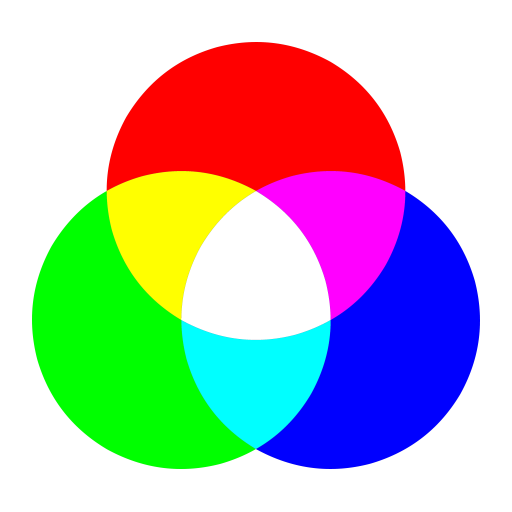
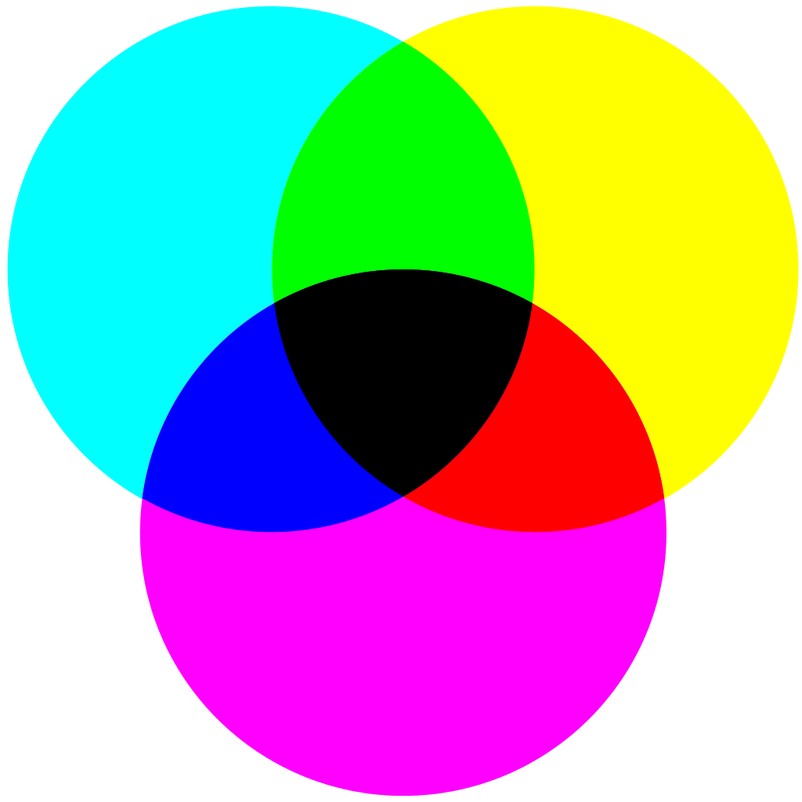

# Color

## Index

* [Color Space](#color-space)
* [Color Model](#color-model)
  * [RGB](#rgb)
  * [CMY](#cmy)
  * [HSL/HSV](#hslhsv)
  * [YUV](#yuv)
  * [Conversions](#conversions)
* [References](#references)

## Color Space

A [color space](https://en.wikipedia.org/wiki/Color_space) is the set of colors and luminance values which can be captured, stored or displayed in a medium.

The [CIE 1931 color spaces](https://en.wikipedia.org/wiki/CIE_1931_color_space) are the first defined quantitative links between distributions of wavelengths in the electromagnetic visible spectrum, and physiologically perceived colors in human color vision. They were created by the [International Commission on Illumination (CIE)](https://en.wikipedia.org/wiki/International_Commission_on_Illumination) in 1931 from a series of experiments that were combined into the specification of the CIE RGB color space, from which the CIE XYZ color space was derived.

<p align="center"></p>
<p align="center">CIE Chromaticity Diagram</p>

In the black band are represented the [spectral colors](https://en.wikipedia.org/wiki/Spectral_color), colors in a relatively narrow band of wavelengths, also known as monochromatic light. Values are expressed in nanometers. This diagram gives a common frame to define color spaces in `xyY` coordinates where `xy` is `chrominance` and `Y` is `luminance`.

A color space represents a [gamut](https://en.wikipedia.org/wiki/Gamut), a set of colors that can be represented, and is defined by:
* Primary colors (R,G,B).
* [White point](https://en.wikipedia.org/wiki/White_point). Color spaces use [illuminants](https://en.wikipedia.org/wiki/Template:Color_temperature_white_points) to define reference whites, each illuminant has a [correlated color temperature (CCT)](https://en.wikipedia.org/wiki/Color_temperature#Correlated_color_temperature). The commonly used standard illuminant is [D65](https://en.wikipedia.org/wiki/Illuminant_D65) at 6504 K.
* [Transfer function](https://en.wikipedia.org/wiki/Transfer_function). [Gamma correction](https://en.wikipedia.org/wiki/Gamma_correction) is a non-linear operation used to encode and decode luminance or tristimulus values. It is used to take advantage of the non-linear manner in which humans perceive light and color.

Converting color spaces depend on the `primary colors` and `white points` and must be done with `lineal values`. There are several lists of [matrices](http://www.brucelindbloom.com/index.html?Eqn_RGB_XYZ_Matrix.html) to convert RGB/XYZ and XYZ/RGB.

RGB(709)/RGB(2020) (assuming same white points)
```
XYZ = RGB709_TO_XYZ_MAT * RGB(709)
RGB(2020) = XYZ_TO_RGB2020_MAT * XYZ
```

XYZ(D50)/XYZ(D65)
```
LMS(D50) = XYZ_TO_LMS_MAT * XYZ(D50)
LMS(D65) = D50_TO_D65_CAT * LMS(D50)
XYZ(D65) = LMS_TO_XYZ_MAT * LMS(D65)
```
White points conversion matrices are called [Chromatic Adaptation Transform (CAT)](https://en.wikipedia.org/wiki/Chromatic_adaptation) and are equivalent to apply a [white balance](https://en.wikipedia.org/wiki/Color_balance).

XYZ/xyY
```
x = X / (X + Y + Z)
y = Y / (X + Y + Z)
Y = Y
```
For black, `X=Y=Z=0`, set `x` and `y` to the chromaticity coordinates of the reference white.

## Color Model

A [color model](https://en.wikipedia.org/wiki/Color_model) is a method to represent colors, typically as tuples of three or four values or components. An image can be represented in memory component-wise or planar-wise.

* Packed formats are represented in memory [X<sub>1</sub>Y<sub>1</sub>Z<sub>1</sub>...X<sub>n</sub>Y<sub>n</sub>Z<sub>n</sub>].
* Planar formats are represented in memory [X<sub>1</sub>...X<sub>n</sub>] [Y<sub>1</sub>...Y<sub>n</sub>] [Z<sub>1</sub>...Z<sub>n</sub>].
* Semi-Planar formats are represented in memory [X<sub>1</sub>...X<sub>n</sub>] [Y<sub>1</sub>Z<sub>1</sub>...Y<sub>n</sub>Z<sub>n</sub>].
* Interleaved formats are represented in memory following a [sampling system](https://en.wikipedia.org/wiki/Chroma_subsampling#Sampling_systems_and_ratios), sampling is expressed as a three part ratio `J:a:b`. For example 4:2:2 has the `Y` and `Z` planes subsampled, they have less information than the `X` plane, [X<sub>1</sub>Y<sub>1</sub>X<sub>2</sub>Z<sub>1 </sub>X<sub>3</sub>Y<sub>2</sub>X<sub>4</sub>Z<sub>2</sub>...X<sub>n-1</sub>Y<sub>m</sub>X<sub>n</sub>Z<sub>m</sub>].

### RGB

[RGB](https://en.wikipedia.org/wiki/RGB_color_model) is an [additive](https://en.wikipedia.org/wiki/Additive_color) color model with a separation of `red`, `green` and `blue` [additive primary colors](https://en.wikipedia.org/wiki/Primary_color).

<p align="center"></p>
<p align="center">Additive Color Mixing</p>

When the red, green and blue components have the same range of values the geometric representation has the shape of a cube otherwise it has the shape of a rectangular prism or cuboid.
<p align="center"></p>
<p align="center">RGB Color Range</p>

There are several [RGB pixel formats](https://en.wikipedia.org/wiki/List_of_monochrome_and_RGB_color_formats), the most common formats are:
* RGB888 or RGB24, uses 24 bits (8 bits per component).
* RGB565, uses 16 bits (5 bits R, 6 bits G and 5 bits B).

### CMY

[CMY](https://en.wikipedia.org/wiki/CMY_color_model) is a [subtractive](https://en.wikipedia.org/wiki/Subtractive_color) color model with a separation of `cyan`, `magenta` and `yellow` [subtractive primary colors](https://en.wikipedia.org/wiki/Primary_color#Subtractive_mixing_of_ink_layers).

<p align="center"></p>
<p align="center">Subtractive Color Mixing</p>

### HSL/HSV

[HSL](https://en.wikipedia.org/wiki/HSL_and_HSV) is a color model with `hue`, `saturation` and `level` components.

<p align="center"></p>
<p align="center">HSL Color Range</p>

[HSV](https://en.wikipedia.org/wiki/HSL_and_HSV) is a color model with `hue`, `saturation` and `value` components (also known as HSB, `hue`, `saturation` and `brightness`).

<p align="center"></p>
<p align="center">HSV Color Range</p>

Both color ranges shapes are cylindrical.
* Hue, the angular dimension, starts at the red primary at 0°, passes through the green primary at 120° and the blue primary at 240°, and then back to red at 360°.
* The central vertical axis is the achromatic grayscale range, from top to bottom, white at lightness 1 to black at lightness 0.
* Primary and secondary colors are around the outside edge of the cylinder with saturation 1. These saturated colors have lightness 0.5 in HSL and value 1 in HSV.
* Mixing these saturated colors with black ([shades](https://en.wikipedia.org/wiki/Tints_and_shades)) leaves saturation unchanged.
* In HSL, mixing with white ([tints](https://en.wikipedia.org/wiki/Tints_and_shades)) leaves saturation unchanged.
* In HSL, mixing with both black and white ([tones](https://en.wikipedia.org/wiki/Tints_and_shades)) reduces saturation.
* In HSV, mixing with white ([tints](https://en.wikipedia.org/wiki/Tints_and_shades)) reduces saturation.

### YUV

[YUV](https://en.wikipedia.org/wiki/YUV) is a color model with `luma` and `chrominance` components. Sometimes `YUV` is also named `YCrCb`, where `Cr` is the red projection plane and `Cb` is the blue projection plane. It was invented when engineers wanted color television in a black-and-white infrastructure.

There are several [YUV pixel formats](https://www.fourcc.org/yuv.php), the recommended formats for video rendering are:
* 4:4:4 (32 bpp)
  * [AYUV](https://docs.microsoft.com/en-us/windows/win32/medfound/recommended-8-bit-yuv-formats-for-video-rendering#ayuv)
* 4:2:2 (16 bpp)
  * [YUY2](https://docs.microsoft.com/en-us/windows/win32/medfound/recommended-8-bit-yuv-formats-for-video-rendering#yuy2)
  * [UYVY](https://docs.microsoft.com/en-us/windows/win32/medfound/recommended-8-bit-yuv-formats-for-video-rendering#uyvy)
* 4:2:0 (16 bpp)
  * [IMC1](https://docs.microsoft.com/en-us/windows/win32/medfound/recommended-8-bit-yuv-formats-for-video-rendering#imc1)
  * [IMC3](https://docs.microsoft.com/en-us/windows/win32/medfound/recommended-8-bit-yuv-formats-for-video-rendering#imc3)
* 4:2:0 (12 bpp)
  * [IMC2](https://docs.microsoft.com/en-us/windows/win32/medfound/recommended-8-bit-yuv-formats-for-video-rendering#imc2)
  * [IMC4](https://docs.microsoft.com/en-us/windows/win32/medfound/recommended-8-bit-yuv-formats-for-video-rendering#imc4)
  * [YV12](https://docs.microsoft.com/en-us/windows/win32/medfound/recommended-8-bit-yuv-formats-for-video-rendering#yv12)
  * [NV12](https://docs.microsoft.com/en-us/windows/win32/medfound/recommended-8-bit-yuv-formats-for-video-rendering#nv12)

### Conversions

RGB888/RGB555
```
short pixel = ((R >> 3) << 11) | ((G >> 2) << 5) | (B >> 3)
```

RGB/YUV
```
Y =  (0.257 * R) + (0.504 * G) + (0.098 * B) + 16
U = -(0.148 * R) - (0.291 * G) + (0.439 * B) + 128
V =  (0.439 * R) - (0.368 * G) - (0.071 * B) + 128
```

YUV/RGB
```
R = 1.164(Y - 16)                  + 1.596(V - 128)
G = 1.164(Y - 16) - 0.391(U - 128) - 0.813(V - 128)
B = 1.164(Y - 16) + 2.018(U - 128)
```

## References

* [Color Theory](https://en.wikipedia.org/wiki/Color_theory)
* [Lists of Colors](https://en.wikipedia.org/wiki/Lists_of_colors)
* [A Beginner's Guide to CIE Colorimetry](https://medium.com/hipster-color-science/a-beginners-guide-to-colorimetry-401f1830b65a)
* [The Essential Guide to Color Spaces](https://blog.frame.io/2020/02/03/color-spaces-101/)
* [Bruce Lindbloom Web Site](http://www.brucelindbloom.com/index.html)
* [Recommended 8-Bit YUV Formats for Video Rendering](https://docs.microsoft.com/en-us/windows/win32/medfound/recommended-8-bit-yuv-formats-for-video-rendering)
* [Image Stride](https://docs.microsoft.com/en-us/windows/win32/medfound/image-stride?redirectedfrom=MSDN)
