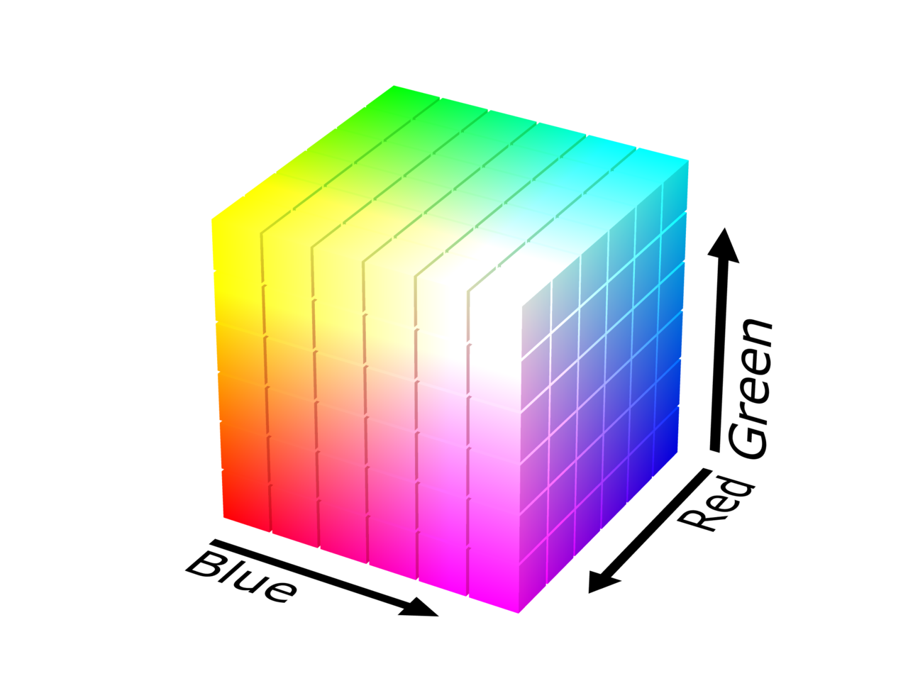

# Color

## Index

* [Color Space](#color-space)
* [Color Model](#color-model)
  * [RGB](#rgb)
  * [CMY](#cmy)
  * [HSL/HSV](#hslhsv)
  * [YUV](#yuv)
* [References](#references)

## Color Space

A [color space](https://en.wikipedia.org/wiki/Color_space) is the set of colors and luminance values which can be captured, stored or displayed in a medium.

The [CIE 1931 color spaces](https://en.wikipedia.org/wiki/CIE_1931_color_space) are the first defined quantitative links between distributions of wavelengths in the electromagnetic visible spectrum, and physiologically perceived colors in human color vision. They were created by the [International Commission on Illumination (CIE)](https://en.wikipedia.org/wiki/International_Commission_on_Illumination) in 1931 from a series of experiments that were combined into the specification of the CIE RGB color space, from which the CIE XYZ color space was derived.

CIE Chromaticity Diagram

## Color Model

A [color model](https://en.wikipedia.org/wiki/Color_model) is a method to represent colors, typically as tuples of three or four values or components. An image can be represented in memory component-wise or planar-wise.

* Packed formats are represented in memory [X1Y1Z1...XnYnZn].
* Planar formats are represented in memory [X1...Xn] [Y1...Yn] [Z1...Zn].
* Semi-Planar formats are represented in memory [X1...Xn] [Y1Z1...YnZn].
* Interleaved formats are represented in memory following a [sampling system](https://en.wikipedia.org/wiki/Chroma_subsampling#Sampling_systems_and_ratios), sampling is expressed as a three part ratio `J:a:b`. For example 4:2:2 has the `Y` and `Z` planes subsampled, they have less information than the `X` plane, [X1Y1X2Z1 X3Y2X4Z2...Xn-1YmXnZm].

### RGB

[RGB](https://en.wikipedia.org/wiki/RGB_color_model) is an [additive](https://en.wikipedia.org/wiki/Additive_color) color model with a separation of red, green and blue [additive primary colors](https://en.wikipedia.org/wiki/Primary_color).

RGB Color Range

* RGB888 uses 24 bits, 8 bits per component [0, 255].
* RGB565 uses 16 bits, 5 bits for R, 6 bits for G and 5 bits for B. The mathematical conversion from RGB888 to RGB565 is `short pixel = ((R >> 3) << 11) | ((G >> 2) << 5) | (B >> 3)`.

### CMY

[CMY](https://en.wikipedia.org/wiki/CMY_color_model) is a [subtractive](https://en.wikipedia.org/wiki/Subtractive_color) color model with a separation of cyan, magenta and yellow [subtractive primary colors](https://en.wikipedia.org/wiki/Primary_color#Subtractive_mixing_of_ink_layers).

### HSL/HSV

[HSL/HSV](https://en.wikipedia.org/wiki/HSL_and_HSV)

### YUV

[YUV](https://en.wikipedia.org/wiki/YUV) is a color model with a separation of luma `Y` and chrominance `U`, `V` components. It was invented when engineers wanted color television in a black-and-white infrastructure. Sometimes `YUV` is also named `YCrCb`, where `Cr` is the red projection plane and `Cb` is the blue projection plane.

## References

* [The Essential Guide to Color Spaces](https://blog.frame.io/2020/02/03/color-spaces-101/)
* [YUV Pixel Formats](https://www.fourcc.org/yuv.php)
* [Recommended 8-Bit YUV Formats for Video Rendering](https://docs.microsoft.com/en-us/windows/win32/medfound/recommended-8-bit-yuv-formats-for-video-rendering)
* [Image Stride](https://docs.microsoft.com/en-us/windows/win32/medfound/image-stride?redirectedfrom=MSDN)
