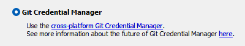

# Git

<p align="center"></p>

[Git](https://git-scm.com/) is a free and open source distributed version control system.

## Index

* [General](#general)
* [Repositories](#repositories)
* [Branches](#branches)
* [Tags](#tags)
* [Make changes](#make-changes)
* [Revert changes](#revert-changes)
* [Stash changes](#stash-changes)
* [Synchronize changes](#synchronize-changes)
* [Show changes](#show-changes)
* [Advanced](#advanced)

## General

<p align="center"></p>

Configure options.
```
git config --global user.name <name>
git config --global user.email <email>

git config --global user.name adcimon
git config --global user.email contact.adcimon@gmail.com
git config --global user.email 37084114+adcimon@users.noreply.github.com
```

List options.
```
git config --list
```

`HEAD` is a symbolic reference pointing to a position in the commit history.
* Attached. It points to a branch reference. When performing certain operations (commits, resets, etc.), the attached branch will move along with `HEAD`.
* Detached. It points to a commit. New commits will not be associated with a branch reference.
```
cat .git/HEAD
```

## Repositories

Initialize a repository
```
git init
```

Download a repository.
```
git clone <url>
git clone --recursive <url>
```

Download a repository at a specific tag.
```
git clone --branch <tag> <url>
```

Add a submodule.
```
git submodule add <submodule> <path>
```

## Branches

List branches.
```
git branch
git branch -r
git branch -r -v
```

Create a new branch.
```
git branch <name>
```

Delete a branch.
```
git branch -d <name>
```

Switch to the specified branch.
```
git checkout <branch>
```

Combine the specified branch's history into the current branch.
```
git merge <branch>
```

Rename a branch.
```
# Rename the local branch to the new name.
git branch -m <old_name> <new_name>

# Delete the old branch on remote.
git push origin --delete <old_name>

# Prevent from using the old name when pushing in the next step.
# Otherwise, it will use the old upstream name instead of the new name.
git branch --unset-upstream <new_name>

# Push the new branch to remote.
git push origin <new_name>

# Reset the upstream branch for the new local branch name.
git push origin -u <new_name>
```

## Tags

List tags.
```
git tag -n
```

Create a tag.
```
git tag <tag>
git push origin <tag>
```

Delete a tag.
```
git push --delete origin <tag>
```

Move a tag to a different commit.
```
git tag -d <tag>
git push origin :refs/tags/<tag>
git tag <tag>
git push origin <tag>
```

## Make changes

Add file contents.
```
git add <file>
git add .
```

Remove file contents.
```
git rm <file>
git rm --cached <file>
git rm -f <file>
```

Record changes to the repository.
```
git commit -m "Message"
```

Modify the last commit.
```
git commit --amend
git commit --amend -m "Updated message"
```

## Revert changes

Revert the changes made to a file.
```
git restore <file>
```

Undo the last commit, preserving changes locally.
```
git reset
git reset HEAD~
```

Revert all commits after the specified commit, preserving changes locally.
```
git reset <commit>
```

Discard all history and changes back to the specified commit.
```
git reset --hard
git reset --hard <commit>
```

## Synchronize changes

Download all history from the remote tracking branches.
```
git fetch
```

Upload all local branch commits.
```
git push
```

Update your current local working branch with all new commits from the corresponding remote branch.
```
git pull
```

## Stash changes

Stash the changes to the top of the stack and reverts the working directory to match the HEAD commit.
```
git stash -m "Message"
git stash push -m "Message"
```

Apply a stash.
```
git stash apply
git stash apply stash@{<index>}
```

Remove the stash from the top of the stack.
```
git stash drop
```

Apply a stash and remove it from the top of the stack.
```
git stash pop
```

Show the stash at the top of the stack.
```
git stash show
```

List all stashes.
```
git stash list
```

## Show changes

Show the state of the working directory and the staging area.
```
git status
```

List version history for the current branch.
```
git log
```

List version history for a file, including renames.
```
git log --follow <file>
```

Show content differences.
```
git diff <file>
git diff <branch1>...<branch2>
```

Show metadata and content changes of the specified commit.
```
git show <commit>
```

## Advanced

Install credential manager with [Git for Windows](https://git-scm.com/download/win).<br>

```
git config --system --unset credential.https://dev.azure.com.useHttpPath 
git config --system credential.helper manager
```
* [Git Credential Manager Core: Building a universal authentication experience](https://github.blog/2020-07-02-git-credential-manager-core-building-a-universal-authentication-experience/)

Large file storage.
```
git lfs install
git lfs track "*.<extension>"
git add .gitattributes
```

Clear history.
```
rm -rf .git

git init
git add .
git commit -m "Initial commit"

git remote add origin git@<url>:<username>/<repository>.git
git remote add origin https://<url>/<username>/<repository>.git

git push -u --force origin master
```

Rewrite user name and email from *ALL* commits.
```
git filter-branch -f --env-filter "GIT_AUTHOR_NAME='name'; GIT_AUTHOR_EMAIL='email'; GIT_COMMITTER_NAME='name'; GIT_COMMITTER_EMAIL='email';" HEAD
git push -f origin
git push -f origin +yourbranch
```
