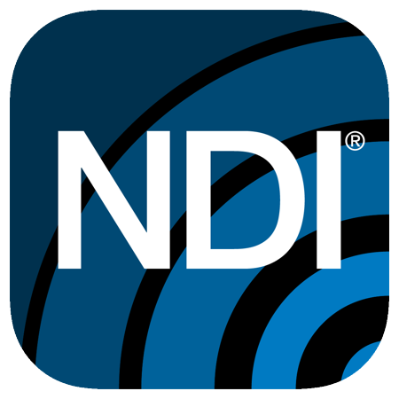

# NDI

<p align="center"></p>

[Network Device Interface (NDI)](https://www.ndi.tv/) is a royalty-free software standard developed by NewTek to enable video-compatible products to communicate, deliver, and receive high-definition video over a computer network in a high-quality, low-latency manner that is frame accurate and suitable for switching in a live production environment.

## Index

* [Web Control](#web-control)
* [Remove Authentication](#remove-authentication)
* [Discover Machines](#discover-machines)

## Web Control

Studio Monitor can be controlled via HTTP requests on ports 80 (first window), 81 (second window), etc.

Get source list.
```
curl http://127.0.0.1/v1/sources
```

Get source list and configuration.
```
curl http://127.0.0.1/v1/configuration
```

Change source to None.
```
curl -H "Content-Type: application/json" -X POST -d '{"version":1,"NDI_source":""}' http://127.0.0.1/v1/configuration
curl -H "Content-Type: application/json" -X POST -d "{\"version\":1,\"NDI_source\":\"\"}" http://127.0.0.1/v1/configuration
```

Change source.
```
curl -H "Content-Type: application/json" -X POST -d '{"version":1,"NDI_source":"<Machine> (<Stream>)"}' http://127.0.0.1/v1/configuration
curl -H "Content-Type: application/json" -X POST -d "{\"version\":1,\"NDI_source\":\"<Machine> (<Stream>)\"}" http://127.0.0.1/v1/configuration
```

Switch on/off hardware acceleration.
```
curl -H "Content-Type: application/json" -X POST -d '{"version":1,"decorations":{"hw_accel":true}}' http://127.0.0.1/v1/configuration
curl -H "Content-Type: application/json" -X POST -d "{\"version\":1,\"decorations\":{\"hw_accel\":false}}" http://127.0.0.1/v1/configuration
```

Switch on/off tally.
```
curl -H "Content-Type: application/json" -X POST -d '{"version":1,"decorations":{"tally":true}}' http://127.0.0.1/v1/configuration
curl -H "Content-Type: application/json" -X POST -d "{\"version\":1,\"decorations\":{\"tally\":false}}" http://127.0.0.1/v1/configuration
```

## Remove Authentication

Navigate to the folder:
```
C:\Users\<User>\AppData\Local\NDI\Studio Monitor\authentication\
```

Delete the file `web_passwords`.

## Discover Machines

Discovery service may help mitigate certain issues related to [Multicast DNS (mDNS)](https://en.wikipedia.org/wiki/Multicast_DNS) traffic on computer networks.

1. Run the `NDI Discovery Service.exe` application located at:
```
C:\Program Files\NDI\NDI 5 Tools\Discovery
```
By default it runs on port `5959`.

<p align="center"></p>

2. Run the `Access Manager` application from `NDI Tools` in the discovereable machines, go to `Advanced`, toggle on `Discovery Servers` and insert the IP address of the machine that runs the server.

<p align="center"></p>

NDI is now using the discovery service instead of mDNS.
