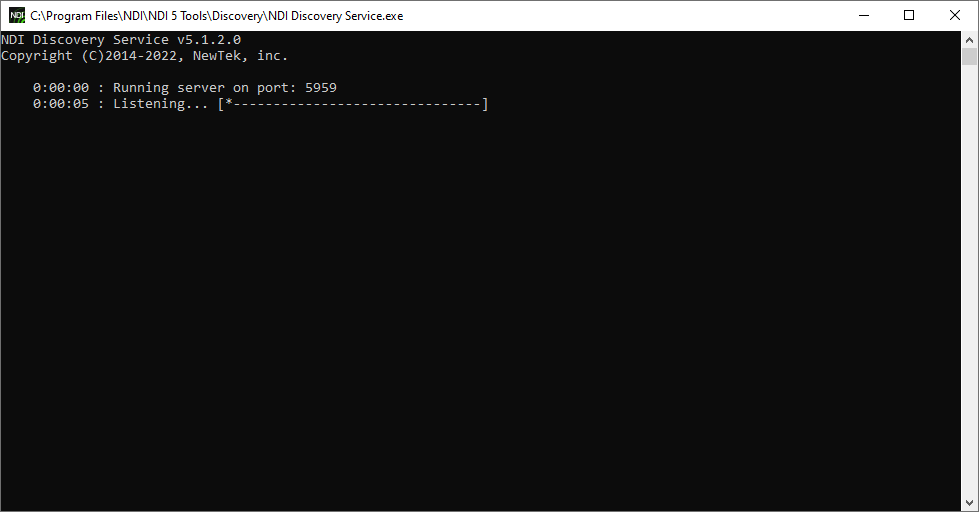
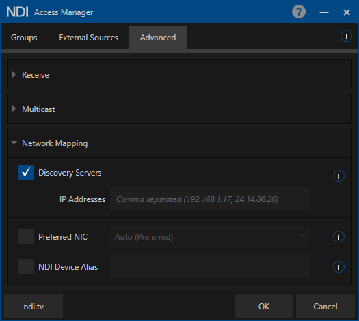

# NDI

[Network Device Interface (NDI)](https://www.ndi.tv/) is a royalty-free software standard developed by NewTek to enable video-compatible products to communicate, deliver, and receive high-definition video over a computer network in a high-quality, low-latency manner that is frame accurate and suitable for switching in a live production environment.

## Discover Machines

Discovery service may help mitigate certain issues related to [Multicast DNS (mDNS)](https://en.wikipedia.org/wiki/Multicast_DNS) traffic on computer networks.

1. Run the `NDI Discovery Service.exe` application located at:
```
C:\Program Files\NDI\NDI 5 Tools\Discovery
```
By default it runs on port `5959`.

<p align="center"></p>

2. Run the `Access Manager` application from `NDI Tools` in the discovereable machines, go to `Advanced`, toggle on `Discovery Servers` and insert the IP address.

<p align="center"></p>
