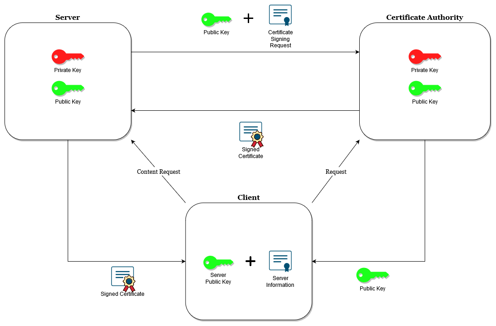

# Security

[Computer security](https://en.wikipedia.org/wiki/Computer_security) (also known as cybersecurity) is the protection of computer software, systems and networks from threats that can lead to unauthorized information disclosure, theft or damage to hardware, software, or data, as well as from the disruption or misdirection of the services they provide.

## Index

* [API Keys](#api-keys)
* [JWT](#jwt)
* [TLS](#tls)
  * [OpenSSL](#openssl)
* [References](#references)

## API Keys

[API keys](https://en.wikipedia.org/wiki/API_key) are secret unique identifiers used to authenticate and authorize a user, developer, or calling program to an API.

### Generation Workflow

1. Ensure the user is registered and authenticated (e.g. via email/password, OAuth).
2. Only authenticated users can generate API keys.
3. Creation.
    * The user requests the creation of an API key pair (e.g. via a specific endpoint like POST /api-keys).
    * Generate a unique `API Key` (public) and a `Secret Key` (private).
        * `API Key`: A unique identifier for the user or client (e.g. UUID or hash).
        * `Secret Key`: A randomly generated, secure string (e.g. 256-bit key).
    * Store the API key and a hashed version of the secret key securely in your database.
        * Use a strong hashing algorithm for the secret key (e.g. `SHA-256` or `bcrypt`).
    * Return the API key and the raw secret key to the user in the response.
        * `Important`: The raw secret key should never be stored in plaintext or retrievable again. Inform the user to save it securely.
4. Management.
    * List API keys for the user (e.g. GET /api-keys).
    * Revoke/delete an API key (e.g. DELETE /api-keys/{key_id}).
    * Regenerate a secret key (e.g. POST /api-keys/{key_id}/regenerate).

### Usage Workflow

1. Authenticate API Requests:
    * Require the API key and secret key for authorized requests.
    * Sent them in the HTTP headers.
```
GET /resource HTTP/1.1
Host: api.example.com
x-api-key: <api_key>
x-api-secret: <secret_key>
```
```
GET /resource HTTP/1.1
Host: api.example.com
Authorization: ApiKey <base64<api_key:secret_key>
```
* Alternatively, for higher security, use only the API Key in headers and sign requests using the secret key.

2. Server-Side Validation:

* Retrieve the hashed secret key for the provided API key from your database.
* Hash the provided secret key from the request and compare it with the stored hash.
* If they match, grant access, otherwise, return a 401 unauthorized response.

## JWT

[JSON Web Tokens (JWT)](https://en.wikipedia.org/wiki/JSON_Web_Token) are an open, industry standard method for representing claims securely between two parties. [JWT.IO](https://jwt.io/) allows to decode, verify and generate tokens.

## TLS

[Transport Layer Security (TLS)](https://en.wikipedia.org/wiki/Transport_Layer_Security) is a cryptographic protocol designed to provide communications security over a computer network. It is used as the security layer in [HTTPS](https://en.wikipedia.org/wiki/HTTPS) and [WSS](https://en.wikipedia.org/wiki/WebSocket).

### OpenSSL

[OpenSSL](https://www.openssl.org/) is a robust, commercial-grade, and full-featured toolkit for the [Transport Layer Security (TLS)](https://en.wikipedia.org/wiki/Transport_Layer_Security) and [Secure Sockets Layer (SSL)](https://en.wikipedia.org/wiki/Transport_Layer_Security) protocols. It is also a general-purpose cryptography library.

Create a [Certificate Signing Request (CSR)](https://en.wikipedia.org/wiki/Certificate_signing_request).
```
openssl req -new -nodes -newkey rsa:2048 -keyout private.key -out request.csr
```
* `req` specifies the use of X.509 certificate signing request management. The X.509 is a public key infrastructure standard that SSL and TLS adheres to for its key and certificate management.
* `-new` specifies the generation of a certificate signing request.
* `-nodes` skips the option to secure our certificate with a passphrase requesting user intervention.
* `-newkey rsa:2048` generates a new certificate and a new key at the same time (required to sign the certificate), `rsa:2048` makes an RSA key that is 2048 bits long.
* `-keyout` specifies the name of the generated private key file.
* `-out` specifies the name of the generated request file.

Create a self-signed certificate.
```
openssl req -x509 -nodes -days 365 -newkey rsa:2048 -keyout private.key -out certificate.crt
```
* `req` specifies the use of X.509 certificate signing request management. The X.509 is a public key infrastructure standard that SSL and TLS adheres to for its key and certificate management.
* `-x509` specifies the generation of a self-signed certificate instead of generating a certificate signing request, as would normally happen.
* `-nodes` skips the option to secure our certificate with a passphrase requesting user intervention.
* `-days` sets the length of time that the certificate will be considered valid.
* `-newkey rsa:2048` generates a new certificate and a new key at the same time (required to sign the certificate), `rsa:2048` makes an RSA key that is 2048 bits long.
* `-keyout` specifies the name of the generated private key file.
* `-out` specifies the name of the generated certificate file.

<p align="center"></p>

## References

* [The Copenhagen Book](https://thecopenhagenbook.com)
