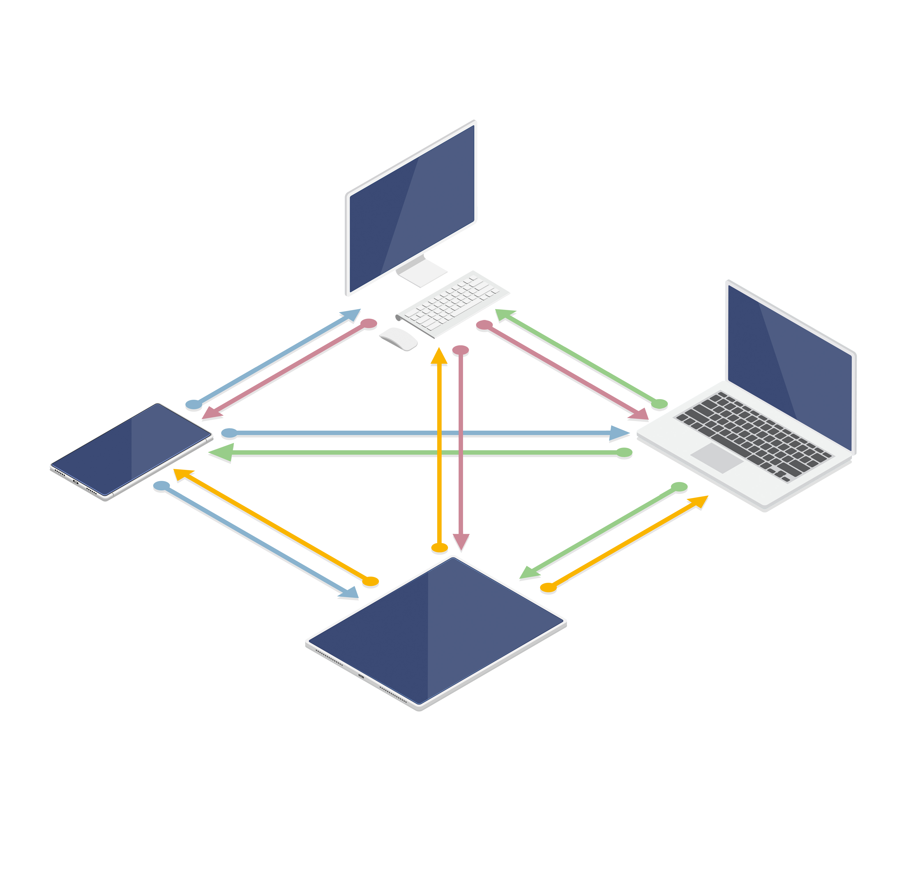
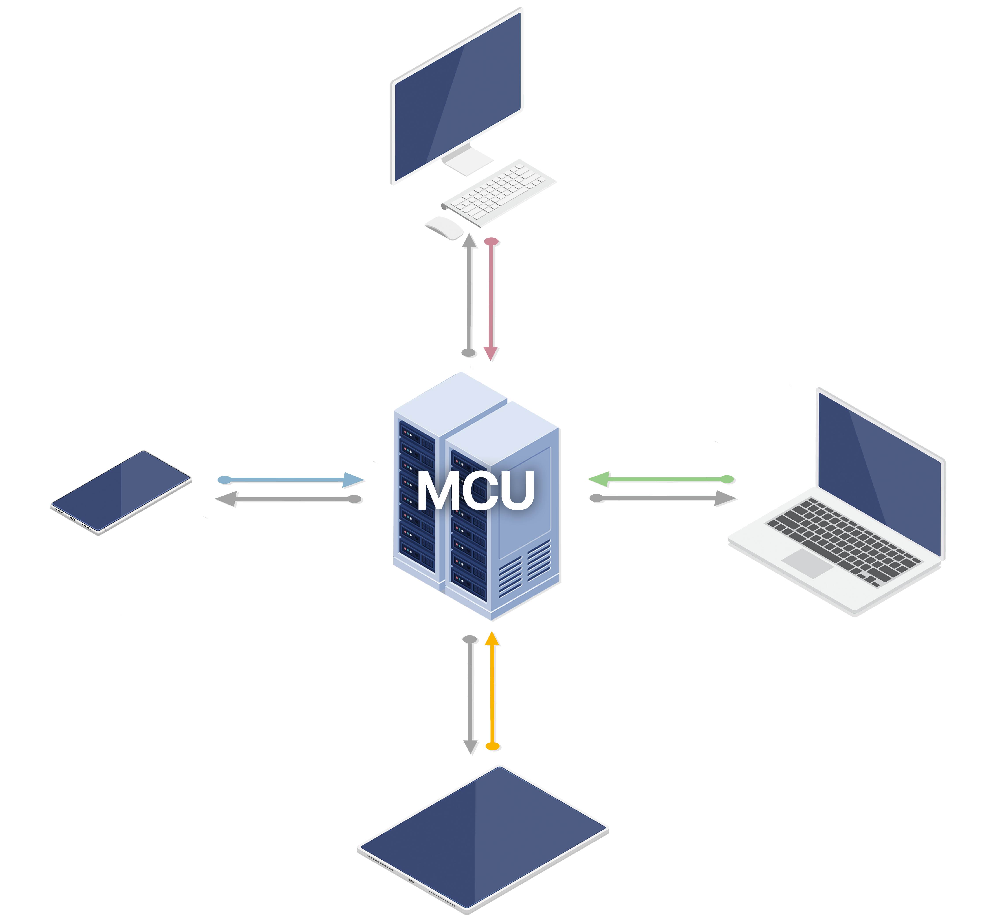
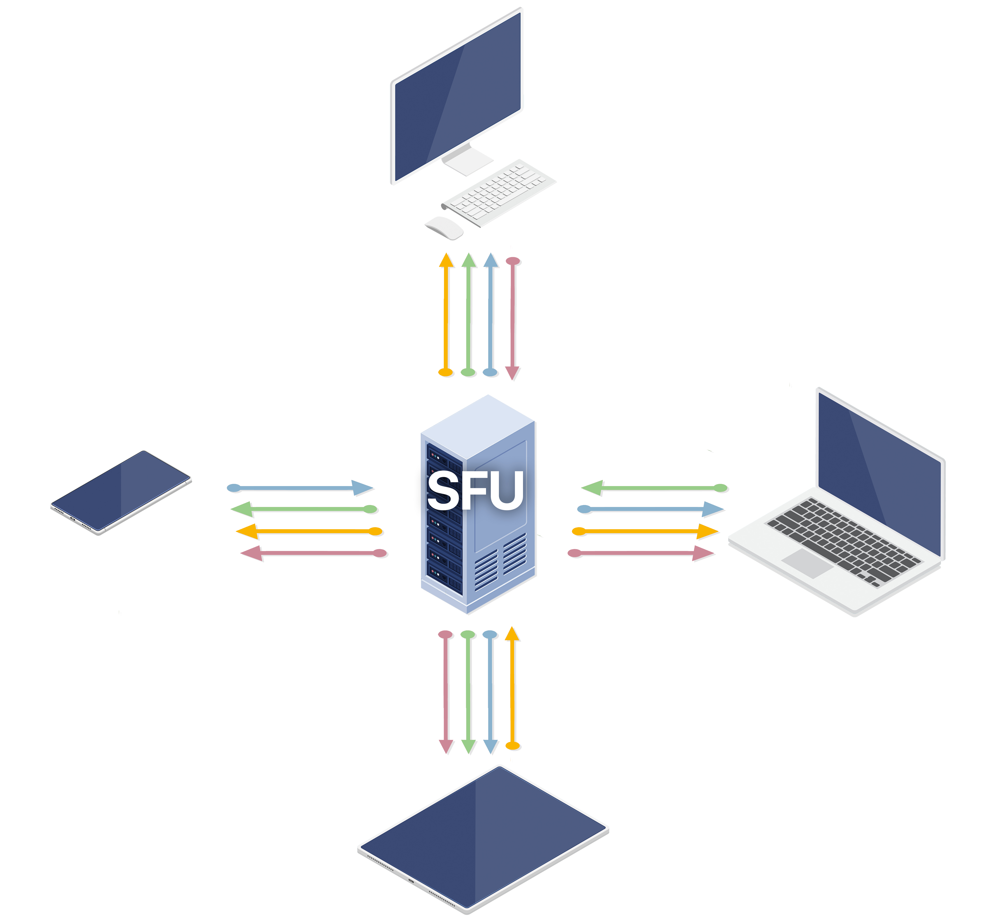
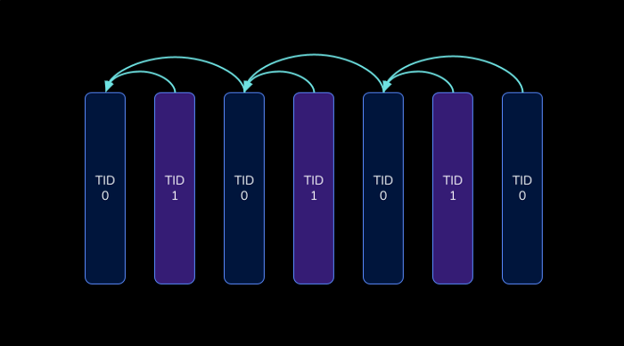

# Streaming

[Streaming](https://en.wikipedia.org/wiki/Streaming_media) is the process of transmitting audio and video data in a continuous flow over a wired or wireless internet connection.

## Index

* [Applications](#applications)
* [Media Servers](#media-servers)
* [Codecs](#codecs)
  * [H.264](#h.264)
* [Transport](#transport)
  * [RTP](#rtp)
  * [RTSP](#rtsp)
  * [RTMP](#rtmp)
  * [HLS](#hls)
  * [NDI](#ndi)
* [Topologies](#topologies)
  * [Mesh](#mesh)
  * [MCU](#mcu)
  * [SFU](#sfu)
* [Bandwidth Strategies](#bandwidth-strategies)
  * [Simulcast](#simulcast)
  * [Scalable Video Coding](#scalable-video-coding)
* [References](#references)

## Applications

Streaming applications are software programs that allow users to reproduce streams or to stream content over the internet. These applications are designed to facilitate the transmission and playback of video data, making it easy for users to watch audiovisual content from anywhere with an internet connection.

There are many streaming applications available, including:
* [Open Broadcaster Software (OBS)](https://obsproject.com/)
* [VLC Media Player](https://www.videolan.org/vlc/)
* [mpv](https://mpv.io/)

## Media Servers

[Media servers](https://en.wikipedia.org/wiki/Media_server) are software programs that deliver video and audio content to clients who request it. The most common use of media servers is to deliver [video on demand (VOD)](https://en.wikipedia.org/wiki/Video_on_demand), in which the media server retrieves prerecorded video content from storage and delivers it across the Internet. Live streaming media servers deliver content as it is generated in real time or with only a slight delay.

There are many streaming media servers available, including:
* [AntMedia](https://github.com/ant-media)
* [Janus](https://github.com/meetecho)
* [Jitsi](https://github.com/jitsi)
* [Kurento](https://github.com/Kurento/kurento-media-server)
* [LiveKit](https://github.com/livekit)
* [Medooze](https://github.com/medooze)
* [Millicast](https://www.millicast.com/)
* [Node Media Server](https://github.com/illuspas/Node-Media-Server)
* [Oven Media Engine](https://github.com/AirenSoft/OvenMediaEngine)
* [RTSP Simple Server](https://github.com/aler9/rtsp-simple-server)
* [Simple Realtime Server](https://github.com/ossrs/srs)

## Codecs

[Codecs](https://en.wikipedia.org/wiki/Codec) are devices or computer programs which encode or decode data streams or signals. [Quantization](https://en.wikipedia.org/wiki/Quantization_(signal_processing)) is used to map input values from a large set (often a continuous set) to output values in a countable smaller set (often a finite set). The greater the quantization step, the lower the quality of the encoded video (lower [Peak signal-to-noise ratio (PSNR)](https://en.wikipedia.org/wiki/Peak_signal-to-noise_ratio)) and the lower the bitrates. Greater quantization comes with lower computation complexity.

### H.264

[Advanced Video Coding (AVC)](https://en.wikipedia.org/wiki/Advanced_Video_Coding) or H.264 is a [video compression standard](https://en.wikipedia.org/wiki/Video_coding_format) based on block-oriented, [motion-compensated coding](https://en.wikipedia.org/wiki/Motion_compensation). There are many kinds of H.264 [profiles](https://en.wikipedia.org/wiki/Advanced_Video_Coding#Profiles) and [levels](https://en.wikipedia.org/wiki/Advanced_Video_Coding#Levels), and not every encoder or decoder supports every profile and level.

**profile-level-id**
* The first byte represents `profile_idc`.
* The second byte represents `profile_iop`. Each bit of it corresponds to `constraint_set{0,1,2,3,4,5}_flag`, a total of 6 bits, the last 2 bits are reserved bits, which are always 0.
* The third byte represents `level_idc`.

**Constrained Baseline** 
Decoders conforming to the `Constrained Baseline` profile at a specific level shall be capable of decoding all bitstreams in which all of the following are true:
* `profile_idc` is equal to 66 or constraint_set0_flag is equal to 1.
* `constraint_set1_flag` is equal to 1.
* `level_idc` and `constraint_set3_flag` represent a level less than or equal to the specified level.

**Examples**
* `0x42001f`
  * The first byte `0x42` (66) corresponds to profile `Baseline Profile`.
  * The third byte `0x1f` (31) corresponds to level `3.1`.
* `0x42e01f`
  * The first byte `0x42` (66) corresponds to profile `Baseline Profile`.
  * The second byte `0xe0` (1 1 1 0 0 0 00) matchs to `Constrained`.
  * The third byte `0x1f` (31) corresponds to level `3.1`.
* `0x4d0032`
  * The first byte `0x4d` (77) corresponds to profile `Main Profile`.
  * The third byte `0x32` (50) corresponds to level `5.0`.
* `0x640032`
  * The first byte `0x64` (100) corresponds to profile `High Profile`.
  * The third byte `0x32` (50) corresponds to level `5.0`.
* `0x640c34`
  * The first byte `0x64` (100) corresponds to profile `High Profile`.
  * The second byte `0x0c` matchs to `Constrained`.
  * The third byte `0x34` (52) corresponds to level `5.2`.

## Transport

Transport protocols are standardized methods of delivering different types of media over the internet. They send chunks of content from one endpoint to another and define the method for reassembling these chunks into playable content on the other endpoint.

### RTP

[Real-time Transport Protocol (RTP)](https://en.wikipedia.org/wiki/Real-time_Transport_Protocol) is a network protocol used in communication and entertainment systems that involve streaming media.

### RTSP

[Real Time Streaming Protocol (RTSP)](https://en.wikipedia.org/wiki/Real_Time_Streaming_Protocol) is an application-level network protocol designed for multiplexing and packetizing multimedia transport streams. The transmission of streaming data itself is not a task of RTSP, most media servers use [RTP](https://en.wikipedia.org/wiki/Real-time_Transport_Protocol) in conjunction with [RTCP](https://en.wikipedia.org/wiki/RTP_Control_Protocol) for media stream delivery. Clients of media servers issue commands such as play, record and pause, to facilitate real-time control of the media streaming. The well known TCP port for RTSP traffic is 554. The most common use case of RTSP is streaming using [IP cameras](https://en.wikipedia.org/wiki/IP_camera).

### RTMP

[Real-Time Messaging Protocol (RTMP)](https://en.wikipedia.org/wiki/Real-Time_Messaging_Protocol) is a communication protocol for streaming audio, video, and data over the Internet that works on top of TCP and uses port number 1935 by default.

### HLS

[HTTP Live Streaming (HLS)](https://en.wikipedia.org/wiki/HTTP_Live_Streaming) is an HTTP-based adaptive bitrate streaming communications protocol. Resembles [MPEG-DASH](https://en.wikipedia.org/wiki/Dynamic_Adaptive_Streaming_over_HTTP) in that it works by breaking the overall stream into a sequence of small HTTP-based file downloads, each downloading one short chunk of an overall potentially unbounded transport stream. A list of available streams, encoded at different bit rates, is sent to the client using an [extended M3U playlist](https://en.wikipedia.org/wiki/M3U).

### NDI

[Network Device Interface (NDI)](https://www.ndi.tv/) is a royalty-free software standard developed by NewTek to enable video-compatible products to communicate, deliver, and receive high-definition video over a computer network in a high-quality, low-latency manner that is frame accurate and suitable for switching in a live production environment.

## Topologies

### Mesh

In a mesh topology each node is directly connected to every other node. Each node sends its streams to every single node and downloads the streams from every node.

For a session with N nodes the total number of connections is `O(N²)`.

| Nodes                    | N      |
|--------------------------|--------|
| Uplinks                  | N(N-1) |
| Downlinks                | N(N-1) |
| Uplinksnode   | N-1    |
| Downlinksnode | N-1    |

Pros:
* Low latency.
* Low server loads.
* End-to-end encryption.

Cons:
* Poor scaling.
* High node loads.
* Connectivity problems with NATs, firewalls, etc.

### MCU

In a Multipoint Conferencing Unit (MCU) topology each node is connected to the MCU server. With a MCU, each node uploads its stream once, the server `decodes` the stream, mixes the streams of all the nodes into one and `encodes` the stream to send it back to each node.

For a session with N nodes the total number of connections is `O(N)`.

| Nodes                    | N |
|--------------------------|---|
| Uplinks                  | N |
| Downlinks                | N |
| Uplinksnode   | 1 |
| Downlinksnode | 1 |

Pros:
* Good scaling.
* Low node loads.
* No connectivity problems.
* Works well in low bandwidth environments.

Cons:
* High latency.
* High server loads.

### SFU

In a Selective Forwarding Unit (SFU) topology each node is connected to the SFU server. With a SFU, each node uploads its stream once and the server `forwards` the stream to every node.

For a session with N nodes the total number of connections is `O(N²)`.

| Nodes                    | N      |
|--------------------------|--------|
| Uplinks                  | N      |
| Downlinks                | N(N-1) |
| Uplinksnode   | 1      |
| Downlinksnode | N-1    |

Pros:
* Good scaling.
* Medium node loads.
* Low server loads.
* No connectivity problems.

Cons:
* No end-to-end encryption (although there are experimental approaches of header only decryption).

## Bandwidth Strategies

### Simulcast

Simulcast allows peers to publish multiple versions of the same stream with different **spatial** or **temporal** encodings, effectively sending more data.

#### Spatial

With spatial scalability the lower resolution layers consume less bandwidth than the high resolution ones.

For example:
* High: 1280x720 2.5mbps
* Medium: 640x360 400kbps
* Low: 320x180 125kbps

The peer uses just 17% more bandwidth to publish the three layers.

#### Temporal

With temporal scalability it is possible to lower a stream's bitrate by dynamically reducing the stream's frame rate. 

Streams contain mostly **delta** frames which depend on previous **key** frames. If the decoder needs to apply a delta to a key frame that was dropped, it can't render subsequent frames.

When temporal layers are used, frames from the base layer only reference other base layer frames.

For a subscriber with limited bandwidth, it is possible to send only the frames of a specific temporal layer, effectively reducing bandwidth.

### Scalable Video Coding

[Scalable Video Coding (SVC)](https://en.wikipedia.org/wiki/Scalable_Video_Coding) is a video compression standard that defines encoding of a high-quality video bitstream that also contains one or more subset bitstreams (a form of layered coding). A subset video bitstream is derived by dropping packets from the larger video to reduce the bandwidth required for the subset bitstream. The subset bitstream can represent a lower spatial resolution (smaller screen), lower temporal resolution (lower frame rate), or lower quality video signal.

## References

* [Internet connection and recommended encoding settings](https://support.video.ibm.com/hc/en-us/articles/207852117-Internet-connection-and-recommended-encoding-settings)
* [H.264 is Magic](https://sidbala.com/h-264-is-magic/)
* [H.264 Profiles](https://www.programmersought.com/article/15615289761/)
* [iSpy Camera Connection Database](https://www.ispyconnect.com/cameras)
* [SRS Video Streaming Service](https://ossrs.io/lts/en-us/blog/SRS-Cloud-Tutorial)
