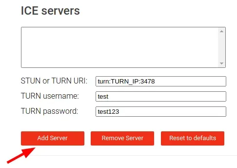
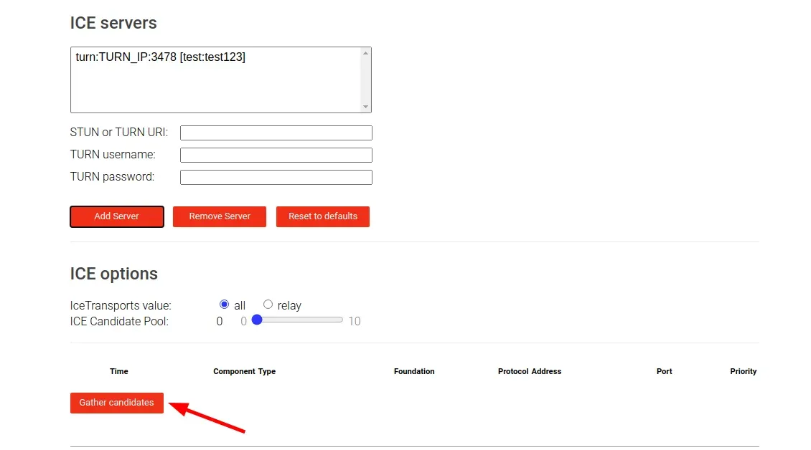
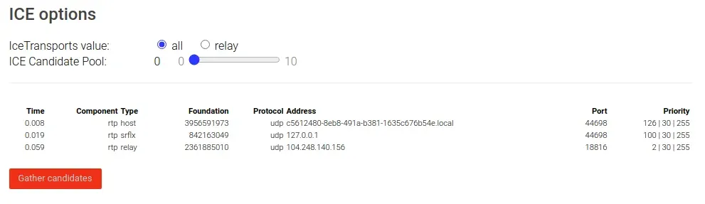

# TURN

[Traversal Using Relays around NAT (TURN)](https://en.wikipedia.org/wiki/Traversal_Using_Relays_around_NAT) is a protocol that assists in traversal of [Network Address Translators (NAT)](https://en.wikipedia.org/wiki/Network_address_translation) or firewalls for multimedia applications. It is most useful for clients on networks masqueraded by [symmetric NAT](https://en.wikipedia.org/wiki/Network_address_translation#Symmetric_NAT) devices.

## Coturn

[Coturn](https://github.com/coturn) is a media traffic NAT traversal server and gateway that can be used as a general-purpose network traffic TURN server.

Install using official docker image [instrumentisto/coturn](https://hub.docker.com/r/instrumentisto/coturn).
```
docker run -d --network=host \
           -v $(pwd)/turnserver.conf:/etc/coturn/turnserver.conf \
           instrumentisto/coturn
```

Configure using the [conf](https://github.com/coturn/coturn/blob/master/examples/etc/turnserver.conf) file.
```
# TURN server name and realm.
realm=test
server-name=turntest

# IPs the TURN server listens to.
listening-ip=0.0.0.0

# External IP-Address of the TURN server.
external-ip=203.0.113.1

# Main listening port.
listening-port=3478

# Ports that are open for communication.
min-port=49152
max-port=49200

# Use fingerprint in TURN message.
fingerprint

# Log file path.
log-file=/etc/coturn/turn.log

# Enable verbose logging.
verbose

# Certificates.
cert=/etc/coturn/cert.pem
pkey=/etc/coturn/pkey.pem

# User for the TURN authentification.
user=test:test123

# Command line password.
cli-password=test123

# Enable long-term credential mechanism.
lt-cred-mech
```

Test using [Trickle ICE](https://webrtc.github.io/samples/src/content/peerconnection/trickle-ice/).

1. Add the TURN server.

<p align="center"></p>

2. Gather ICE candidates.

<p align="center"></p>

3. Check ICE candidates.

<p align="center"></p>

## References

* [Coturn Wiki](https://github.com/coturn/coturn/wiki/)
* [BigBlueButton Configure TURN](https://docs.bigbluebutton.org/admin/setup-turn-server.html)
