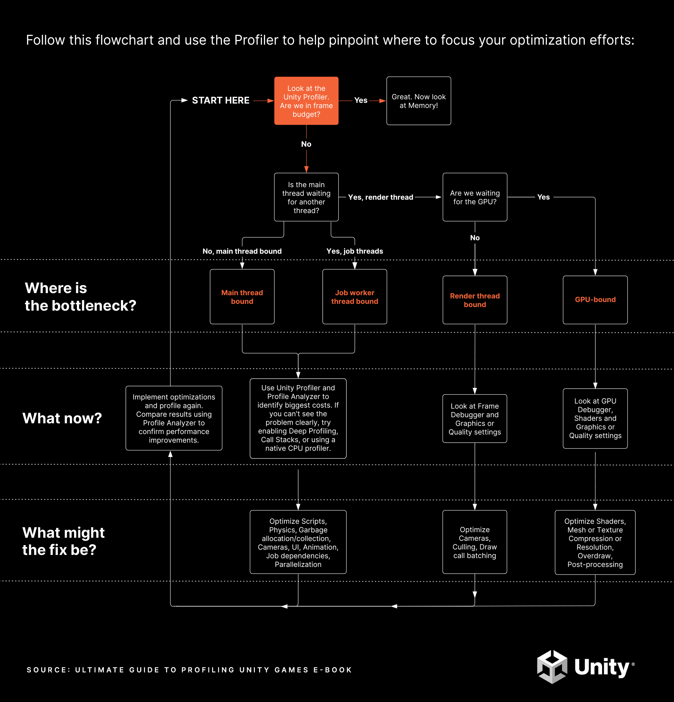

# Unity

<p align="center"></p>

[Unity](https://unity.com/) is a cross-platform game engine.

## Index

* [General](#general)
* [Packages](#packages)
* [Profiling](#profiling)
* [WebGL](#webgl)
* [References](#references)

## General

Check project version.
* Open `<ProjectName>/ProjectSettings/ProjectVersion.txt`.
* Find `m_EditorVersion` or `m_EditorVersionWithRevision` (with changeset).

Change a project name.
* Rename the project folder.
* Open `<ProjectName>/ProjectSettings/ProjectSettings.asset` with a text editor.
* Find `productName` and change the name.

Use Visual Studio Code.
* Go to `Package Manager`.
* Install `Visual Studio Editor` package.
* Go to `Edit → Preferences → External Tools`.
* Select `Visual Studio Code` in `External Script Editor`.
* Click `Regenerate project files`.
* Go to Visual Studio Code.
* Install [Unity](https://marketplace.visualstudio.com/items?itemName=VisualStudioToolsForUnity.vstuc) plugin.
  * Requires .NET SDK.

Debug Android application.
* Connect the Android device to the computer using USB.
* Navigate to the `platform-tools` folder (`C:\Android\sdk\platform-tools`).
* Run `adb logcat -s Unity`.

Use a custom Android manifest file.
* Create the `AndroidManifest.xml` file.
* Import the manifest file to the folder `Assets/Plugins/Android/`.

## Packages
A package is a container that holds any combination of Assets, Shaders, Textures, plug-ins, icons, and scripts that enhance various parts of the project.

Package manifests, `package.json` files, determine which version of the package to load, and what information to display in the Package Manager.
```
{
    "name": "com.adcimon.mypackage",
    "displayName": "My Package",
    "version": "0.0.1",
    "type": "library",
    "unity": "2019.3",
    "description": "My awesome package",
    "keywords":
    [
        "gui",
        "maths"
    ],
    "category": "Interface",
    "dependencies":
    {
        "com.unity.ugui": "1.0.0"
    }
}
```
* `name` is the officially registered package name, following the naming convention `com.org.name`.
* `displayName` is the package name as it appears in the Package Manager.
* `version` is the package version following the [Semantic Versioning](https://semver.org/) system `MAJOR.MINOR.PATCH`.
* `type` specifies the type of the package, `tests`, `sample`, `template`, `module`, `library` or `tool`.
* `unity` is the Unity version that supports the package.
* `description` is a brief description of the package.
* `keywords` are used for searching in the Package Manager, specified as a JSON array of strings.
* `category` specifies the category the packages is in.
* `dependencies` is a list of packages that the package depends on, expressed as a JSON dictionary where the key is the package name and the value is the version number. Unity downloads all dependencies and loads them into the project alongside the package.

**Newtonsoft JSON**

Add the package.
```
"dependencies":
{
    ...
    "com.unity.nuget.newtonsoft-json": "3.0.2"
}
```

## Profiling

* [Ultimate guide to profiling Unity games](https://resources.unity.com/games/ultimate-guide-to-profiling-unity-games)
* [Profiling in Unity 2021 LTS: What, when, and how](https://blog.unity.com/technology/profiling-in-unity-2021-lts-what-when-and-how)
* [Pick up these helpful tips on advanced profiling](https://blog.unity.com/technology/pick-up-these-helpful-tips-on-advanced-profiling)

<p align="center"></p>

## WebGL

* C#/JavaScript Interop: https://docs.unity3d.com/Manual/webgl-interactingwithbrowserscripting.html
* WebGL Deploying: https://docs.unity3d.com/Manual/webgl-deploying.html

## References

* [Unity Best Practices](https://unity.com/how-to)
* [Serialization Best Practices](https://forum.unity.com/threads/serialization-best-practices-megapost.155352/)
