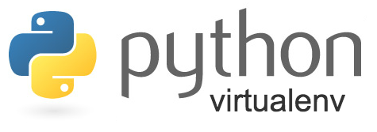

# Virtualenv

<p align="center"></p>

[Virtualenv](https://virtualenv.pypa.io/en/latest/) is a tool to create isolated Python environments.

Install.
```
pip install virtualenv
```

Create a virtual environment.
```
python -m venv <env>
```

Activate a virtual environment.
```
source <env>/bin/activate
<env>\Scripts\activate.bat
```

Check Python location.
```
which python
where python
```

Deactivate a virtual environment.
```
deactivate
deactivate.bat
```