# WebRTC

<p align="center"></p>

[Web Real Time Communication (WebRTC)](https://webrtc.org/) is a free and open-source project providing web browsers and mobile applications with real-time [peer-to-peer](https://en.wikipedia.org/wiki/Peer-to-peer) communications. Its specification is still an ongoing work as a cooperative effort between the [World Wide Web Consortium (W3C)](https://en.wikipedia.org/wiki/World_Wide_Web_Consortium) defining the APIs and the [Internet Engineering Task Force(IETF)](https://en.wikipedia.org/wiki/Internet_Engineering_Task_Force) standardizing the protocols.

## Index

* [Signaling](#signaling)
* [Connectivity](#connectivity)
* [Media](#media)
* [Data](#data)
* [Security](#security)
* [Libraries](#libraries)
  * [libwebrtc](#libwebrtc)
* [Profiling](#profiling)
* [References](#references)

## Signaling

WebRTC uses a [peer-to-peer](https://en.wikipedia.org/wiki/Peer-to-peer) distributed architecture. Although public APIs and protocols are standardized, the initial negotiation and communication establishment is up to the application to implement. This initial handshaking should take care of simple stuff, such as letting one peer know when the other is calling, or more complex stuff like establishing a unique session between two peers and sharing offers, answers and candidates. The part of the application that is in charge of these is called the [signaling server](https://en.wikipedia.org/wiki/Signaling_gateway).

A signaling server should handle:

* **Authentication**. Exchange certificates for secure communication.
* **Media capabilities**. Both peers need to agree on the media formats the session will support.
* **Connection endpoints**. Each peer needs to know how to send data to the other peer.

It is up to the application to ensure that this out-of-bounds communication is performed securely and accessible for both peers. However, there is a draft proposing a signaling protocol for media ingestion called [WebRTC-HTTP ingestion protocol (WHIP)](https://www.ietf.org/archive/id/draft-ietf-wish-whip-01.html). This protocol aims to to solve the need in the broadcast industry of a standard WebRTC signaling protocol for stream ingestion on media servers.

## Connectivity

[Interactive Connectivity Establishment (ICE)](https://en.wikipedia.org/wiki/Interactive_Connectivity_Establishment) is a protocol for [Network Address Translator (NAT)](https://en.wikipedia.org/wiki/Network_address_translation) traversal used in computer networking to find ways for two computers to talk to each other as directly as possible in peer-to-peer networking.

In a real world scenario, establishing a WebRTC connection between 2 peers, caller and callee, using ICE has the following steps:

**1. Address discovery**

Each peer is located in a LAN behind a NAT and has a private address, to discover their public addresses each peer uses the [Session Traversal Utilities for NAT (STUN)](https://en.wikipedia.org/wiki/STUN) server.

<p align="center">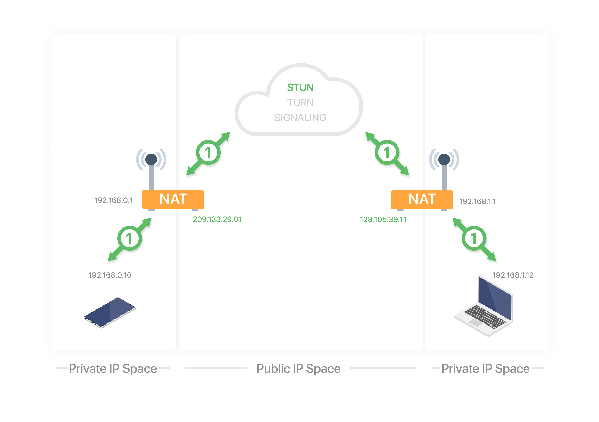</p>

**2. Caller relay allocation**

The caller allocates a connection in the [Traversal Using Relays around NAT (TURN)](https://en.wikipedia.org/wiki/Traversal_Using_Relays_around_NAT) server. The TURN server **relays** the data between two peers when a direct connection is not possible.

<p align="center">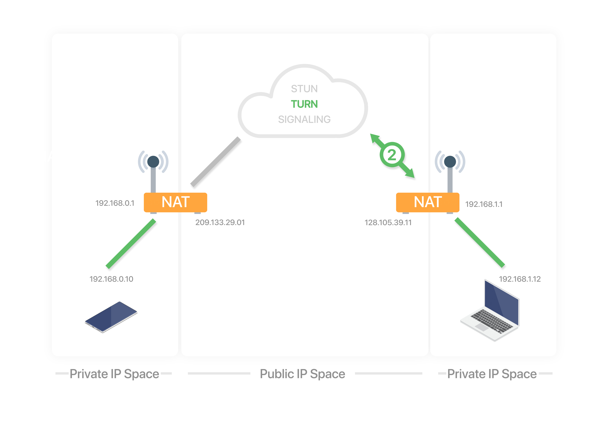</p>

**3. Caller sends offer**

The caller sends a connection **offer** to the callee using a signaling server (both peers are already registered in the signaling server).

<p align="center">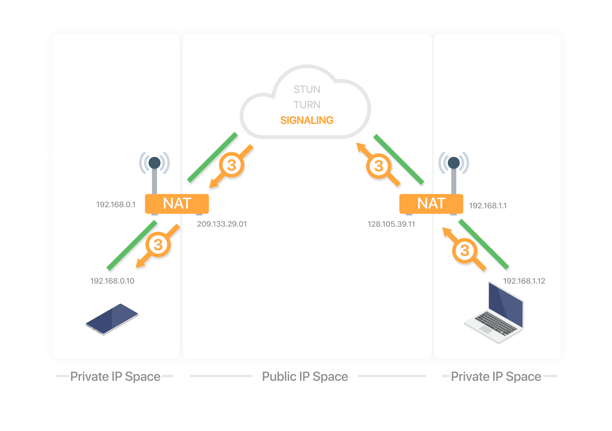</p>

**4. Callee relay allocation**

The callee receives the **offer** and allocates a connection in the TURN server.

<p align="center">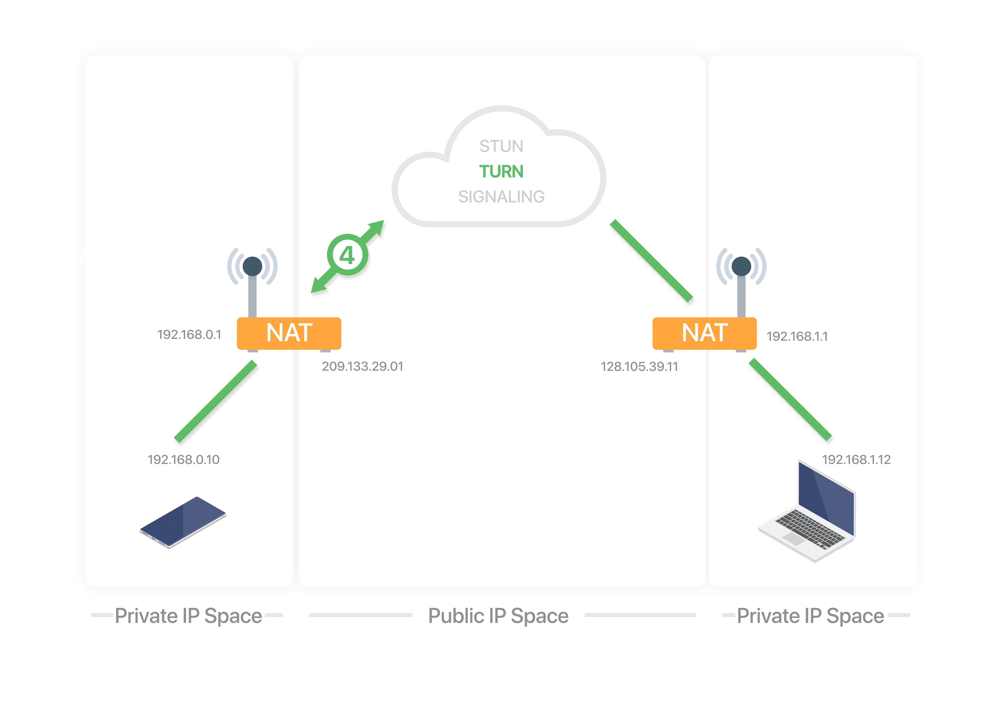</p>

**5. Callee sends answer**

The callee sends a connection **answer** to the caller using the signaling server.

<p align="center">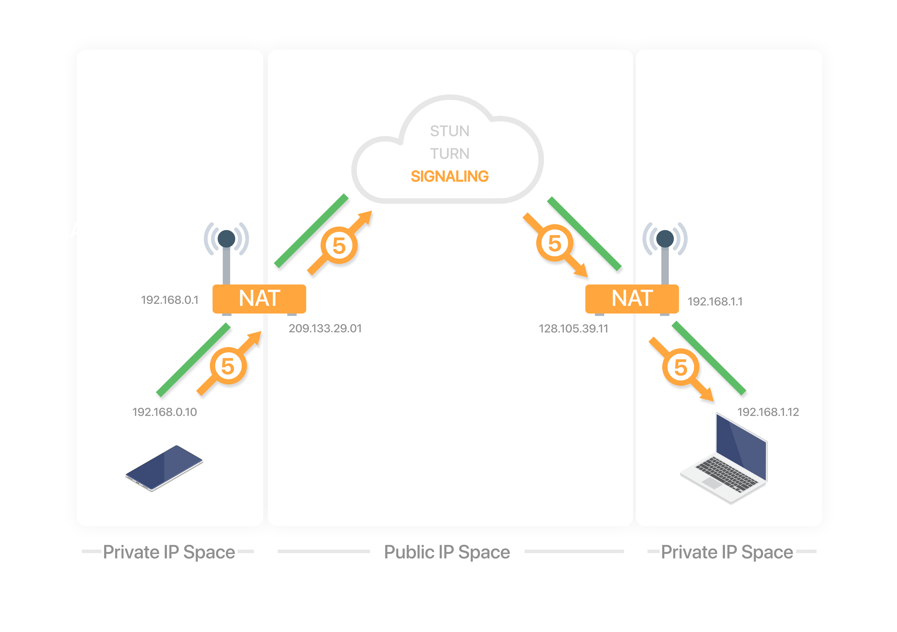</p>

**6. Candidate exchange**

During the offer/answer process, each peer **gathers** candidates to be used for ICE. Each candidate is a potential address/port to receive the data. There are 3 types of candidates:

* **Host**. Generated by the peer by binding to its private IP addresses and ports.
* **Reflex**. Generated by sending query messages to a STUN/TURN server. The query passes through the NAT which creates a binding. The response to the query contains the public IP and port that was generated for the binding.
* **Relay**. Generated by sending query messages to a TURN server. The query passes through the NAT which creates a NAT binding. The response to the query contains the public IP and port that was generated for the binding.

After each candidate is gathered, the candidate is exchanged with the other peer via the offer/answer or standalone using trickle ICE.

<p align="center">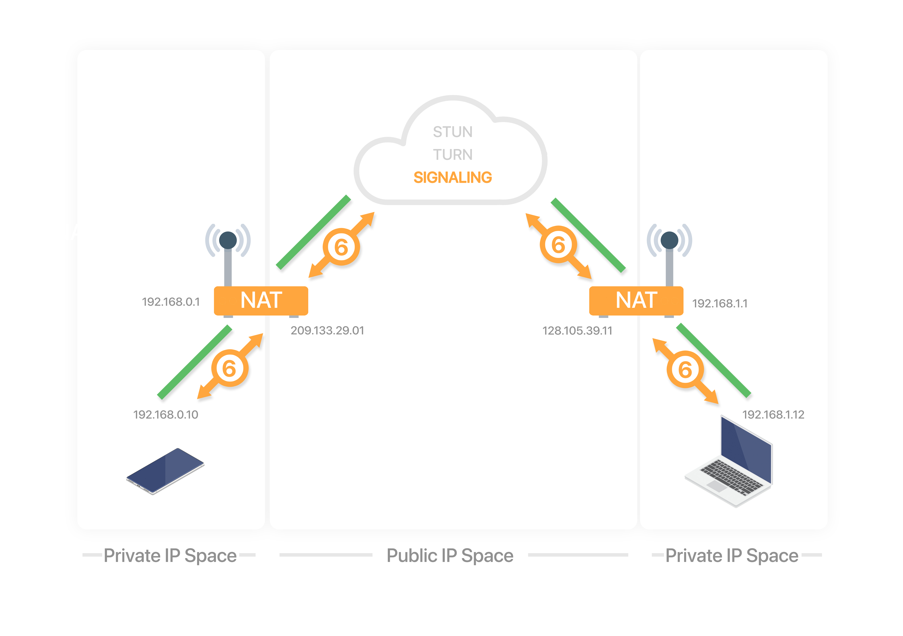</p>

**7a. Check direct connection**

Each peer has an ICE agent making connectivity checks:

* Matches its local candidates with its remote candidates, creating candidate pairs.
* Sends connectivity checks every 20ms, in pair priority, over the binding requests from the local candidate to the remote candidate.
* After receiving the request, the agent generates a response.
* If the response is received, the check has succeeded.

This process may produce additional candidates known as **peer reflexive** candidates. This happens when there is a symmetric NAT in between peers. During the connectivity check process, a STUN request is sent directly to the peer, which can generate a brand new binding. If it does, the STUN response is sent back informing the originating peer that a new binding was formed. This allows peers to have a direct media path between them, even in the presence of a symmetric NAT.

| NAT Type                                                                                                       | STUN support |
|----------------------------------------------------------------------------------------------------------------|--------------|
| [Full Cone NAT](https://en.wikipedia.org/wiki/Network_address_translation#Full-cone_NAT)                       | Yes          |
| [Address Restricted Cone NAT](https://en.wikipedia.org/wiki/Network_address_translation#Restricted-cone_NAT)   | Yes          |
| [Port Restricted Cone NAT](https://en.wikipedia.org/wiki/Network_address_translation#Port-restricted_cone_NAT) | Yes          |
| [Symmetric NAT](https://en.wikipedia.org/wiki/Network_address_translation#Symmetric_NAT)                       | No           |

<p align="center">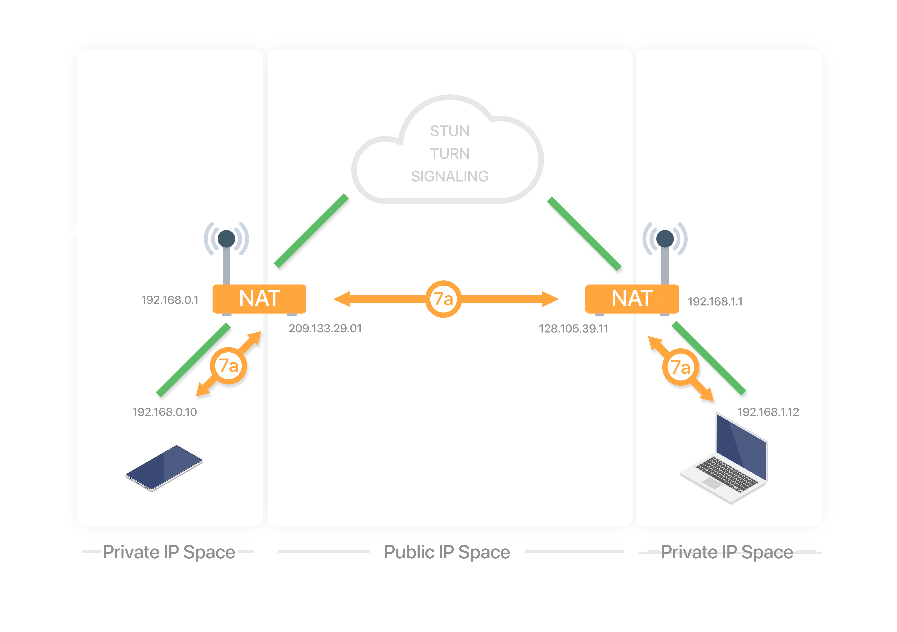</p>

**7b. Use relay connection**

When a direct connection is not possible, the relay candidates are used. TURN servers are guaranteed to work because they are publicly available, unless NATs are specifically configured to block them.

<p align="center">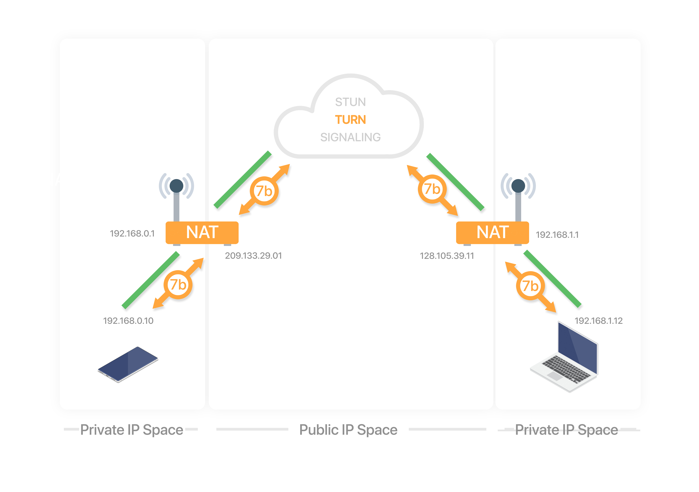</p>

A complete message flow of a peer to peer connection establishment is shown in the diagram below:

<p align="center">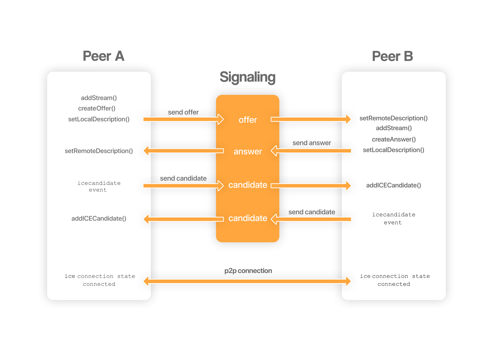</p>

## Media

WebRTC establishes a [baseline set of codecs](https://datatracker.ietf.org/doc/html/rfc7742) which all compliant applications are required to support. Applications may choose to allow other codecs as well. The minimum codecs required are:

* Audio
  * [Opus](https://developer.mozilla.org/en-US/docs/Web/Media/Formats/Audio_codecs#opus)
  * [G.711 PCM (A-law)](https://developer.mozilla.org/en-US/docs/Web/Media/Formats/Audio_codecs#g.711_pulse_code_modulation_of_voice_frequencies)
  * [G.711 PCM (µ-law)](https://developer.mozilla.org/en-US/docs/Web/Media/Formats/Audio_codecs#g.711_pulse_code_modulation_of_voice_frequencies)
* Video
  * [VP8](https://developer.mozilla.org/en-US/docs/Web/Media/Formats/WebRTC_codecs#vp8)
  * [AVC/H.264 Constrained Baseline](https://developer.mozilla.org/en-US/docs/Web/Media/Formats/WebRTC_codecs#avc_h.264)

Media streams (audio and video) are delivered through [Real-time Transport Protocol (RTP)](https://en.wikipedia.org/wiki/Real-time_Transport_Protocol). This protocol was designed to ensure timely and ordered packet arrival while tolerating data loss due to unreliable channels. RTP is usually used in conjunction with [Real-time Transport Control Protocol (RTCP)](https://en.wikipedia.org/wiki/RTP_Control_Protocol), which provides statistics, quality-of-service and synchronization data to the participants of the session.

Some of the packets sent using RTCP are:

* [Receiver Estimated Maximum Bitrate (REMB)](https://webrtcglossary.com/remb/). Used to provide bandwidth estimation in order to avoid creating congestion in the network.
* [Picture Loss Indication (PLI)](https://webrtcglossary.com/pli/). Used to request the sender to send a new keyframe.

[Session Description Protocol (SDP)](https://en.wikipedia.org/wiki/Session_Description_Protocol) is the protocol used to represent the media capabilities of each peer. SDP is already used in other protocols like [Real Time Streaming Protocol (RTSP)](https://en.wikipedia.org/wiki/Real_Time_Streaming_Protocol) or [Session Initiation Protocol (SIP)](https://en.wikipedia.org/wiki/Session_Initiation_Protocol) in streaming applications such as [voice over IP (VoIP)](https://en.wikipedia.org/wiki/Voice_over_IP).

A SDP is generated and sent from each peer during the **offer/answer** process. A SDP has the following structure:

**Session**
```
v=  (protocol version number, currently only 0)
o=  (originator and session identifier: username, id, version number, network address)
s=  (session name: mandatory with at least one UTF-8-encoded character)
i=* (session title or short information)
u=* (URI of description)
e=* (zero or more email address with optional name of contacts)
p=* (zero or more phone number with optional name of contacts)
c=* (connection information—not required if included in all media)
b=* (zero or more bandwidth information lines)
One or more time descriptions ("t=" and "r=" lines; see below)
z=* (time zone adjustments)
k=* (encryption key)
a=* (zero or more session attribute lines)
Zero or more Media descriptions (each one starting by an "m=" line; see below)
```

**Time**
```
t=  (time the session is active)
r=* (zero or more repeat times)
```

**Media**
```
m=  (media name and transport address)
i=* (media title or information field)
c=* (connection information — optional if included at session level)
b=* (zero or more bandwidth information lines)
k=* (encryption key)
a=* (zero or more media attribute lines — overriding the Session attribute lines)
```

**Example 1**
```
v=0
o=- 0 0 IN IP4 10.47.16.5
s=session9000
c=IN IP4 224.2.17.12/127
t=0 0
m=audio 8080 RTP/AVP 111
a=rtpmap:111 OPUS/48000
m=video 9090 RTP/AVP 96
a=rtpmap:96 VP8/90000
```
* Session named `session9000`.
* NTP timestamps for start and end of the session `0 0`.
* Audio:
  * RTP port `8080`.
  * RTCP port `8081` (RTP+1).
  * RTP Profile for Audio and Video (RTP/AVP).
  * Payload type `111` corresponds to codec `OPUS/48000`.
* Video:
  * RTP port `9090`.
  * RTCP port `9091` (RTP+1).
  * RTP Profile for Audio and Video `RTP/AVP`.
  * Payload type `96` corresponds to codec `VP8/90000`.

**Example 2**
```
v=0
o=jdoe 2890844526 2890842807 IN IP4 224.2.17.12
s=-
c=IN IP4 224.2.17.12
t=2873397496 2873404696
m=video 5004 RTP/AVP 96 97
a=rtpmap:96 VP8/90000
a=rtpmap:97 H264/90000
```
* NTP timestamps for start and end of the session `2873397496 2873404696`.
* Video:
  * RTP port `5004`.
  * RTCP port `5005` (RTP+1).
  * RTP Profile for Audio and Video `RTP/AVP`.
  * Payload Type can be `96` or `97`, the participant prefers `96`, but remotes could choose to send any of them.
  * Payload type `96` corresponds to codec `VP8/90000`.
  * Payload type `97` corresponds to codec `H264/90000`.

**Example 3**
```
v=0
o=- 0 0 IN IP4 127.0.0.1
s=-
c=IN IP4 127.0.0.1
t=0 0
m=audio 5006 RTP/AVP 111
a=rtpmap:111 OPUS/48000/2
a=fmtp:111 minptime=10;useinbandfec=1
m=video 5004 RTP/AVP 96 98 102
a=rtcp:54321
a=rtpmap:96 VP8/90000
a=rtpmap:98 VP9/90000
a=rtpmap:102 H264/90000
a=fmtp:102 profile-level-id=42001f
```
* RTCP port `54321`.
* `fmpt` (format parameter) lines have advanced codec parameters.
  *  `minptime` and `useinbandfec` for Opus.
  *  `profile-level-id` for H.264.

## Data

WebRTC lets you send text or binary data over an active connection to a peer, these connections are called [data channels](https://developer.mozilla.org/en-US/docs/Games/Techniques/WebRTC_data_channels). The underlying data streams are delivered through [Stream Control Transmission Protocol (SCTP)](https://en.wikipedia.org/wiki/Stream_Control_Transmission_Protocol). SCTP is a message-oriented transport protocol that ensures reliable, in-sequence transport of messages and congestion control. It differs from UDP and TCP in providing multi-homing and redundant paths to increase resilience and reliability.

|                    | UDP              | TCP           | SCTP             |
|--------------------|------------------|---------------|------------------|
| Reliability        | Unreliable       | Reliable      | Configurable     |
| Delivery           | Unordered        | Ordered       | Configurable     |
| Transmission       | Message-oriented | Byte-oriented | Message-oriented |
| Flow control       | No               | Yes           | Yes              |
| Congestion control | No               | Yes           | Yes              |

## Security

[Secure Real-time Transport Protocol (SRTP)](https://en.wikipedia.org/wiki/Secure_Real-time_Transport_Protocol) and [Secure Real-time Transport Control Protocol (SRTCP)](https://en.wikipedia.org/wiki/Secure_Real-time_Transport_Protocol) allow secure data transmission for RTP and RTCP. SRTP enables RTP with authentication and encryption features, and may be disabled if desired, without the need of going back to pure RTP.

Media and data are transmited over [Datagram Transport Layer Security (DTLS)](https://en.wikipedia.org/wiki/Datagram_Transport_Layer_Security), which is based on [Transport Layer Security (TLS)](https://en.wikipedia.org/wiki/Transport_Layer_Security). DTLS preserves the semantics of the underlying SRTP, SRTCP and SCTP but provides means of authentication, symmetric cryptography, privacy and integrity.

## Libraries

There are many libraries that implement the WebRTC protocol stack, including:

* [libwebrtc](https://webrtc.googlesource.com/src/)
  * [WebRTC Builds](https://github.com/shiguredo-webrtc-build/webrtc-build)
* [Pion](https://github.com/pion/webrtc)
* [aiortc](https://github.com/aiortc/aiortc)
* [WebRTC.rs](https://github.com/webrtc-rs/webrtc)
* [libdatachannel](https://github.com/paullouisageneau/libdatachannel)

### libwebrtc

[libwebrtc](https://webrtc.googlesource.com/src) is an open source C++ implementation of WebRTC developed by Google.

#### Build

[WebRTC Native Code](https://webrtc.github.io/webrtc-org/native-code/) package is meant for browser developers who want to integrate WebRTC. Application developers are encouraged to use the WebRTC API instead.

📦 1. Install prerequisites

Platform.
* Windows (10+).
* macOS (12+).
* Linux (Ubuntu 20.04+).

Dependencies.

* For Linux.
```
sudo apt-get update
sudo apt-get install python3 git curl lsb-release build-essential
```

* For macOS.
  * Install Xcode 14+.
```
brew install python git curl
```

* For Windows.
  * Install `Python 3`.
  * Install `Git for Windows`.
  * Install `Visual Studio 2022` with `Desktop development with C++` workload.
  * Use `x64 Native Tools Command Prompt for VS 2022`.

📁 2. Get depot_tools

Google's `depot_tools` is required for fetching and building Chromium-related projects.

Clone.
```
git clone https://chromium.googlesource.com/chromium/tools/depot_tools.git
```

Add to path.

* For Linux/macOS.
```
export PATH="$PATH:/path/to/depot_tools"
```

* For Windows.
```
set PATH=C:\path\to\depot_tools;%PATH%
```

⬇️ 3. Fetch source

Create a working directory.
```
mkdir webrtc-checkout
cd webrtc-checkout
```

Use `fetch` to get the source.
```
fetch --nohooks webrtc
```

Pull the latest version (or a specific branch/tag/commit).
```
git checkout branch-heads/6210    # Optional checkout.
gclient sync
```

⚙️ 4. Configure build

`gn` is used to configure the build and generate `Ninja` build files.
* [BUILD.gn](https://webrtc.googlesource.com/src/+/e9c3f0158c826af7a564a37ef0d513476fa89ec6/BUILD.gn) file is used to generate build files for multiple operating systems, executables, shared libraries, etc.
* [webrtc.gni](https://webrtc.googlesource.com/src/+/49850c328cd4ba9c0ddeb0e8763bf13718188433/webrtc.gni) file contains boolean flags to control which components of the project are built.

Generate build files.
```
cd src
gn gen out/Default
gn gen out/Default --args="is_debug=false treat_warnings_as_errors=false rtc_build_examples=true rtc_include_tests=false"
```
* List build flags: `gn args <build_directory> --list`.

Optional common arguments.
```
is_debug                          # Release build.
treat_warnings_as_errors          # Treat warnings as errors.
rtc_use_h264                      # Enable H.264 codec.
target_cpu="x64"                  # CPU targets (x86, x64, arm64, etc.).
rtc_build_examples                # Build examples.
rtc_include_tests                 # Build tests.
```

🔨 5. Build with Ninja

Build all.
```
ninja -C out/Default
```

Build specific targets.
```
ninja -C out/Default peerconnection_server
ninja -C out/Default webrtc
```

The static library is located at `webrtc-checkout/src/out/Default/obj/[libwebrtc.a|webrtc.lib]`.

🧪 Verify

Run the sample.
```
out/Default/peerconnection_server
```

📝 Notes

* It generates a static `a` or `lib` library to link into an application.
* It doesn't separate headers from source, instead, it is needed to include the entire source tree and manage include paths.
* It is common to wrap it in a C/C++ interface for easier integration into an application.

### Usage

1. Link the `à` or `lib` library.
2. Add include directories.
* <webrtc_root>
* <webrtc_root>/third_party/abseil-cpp
* <webrtc_root>/third_party/libyuv/include  # If using libyuv
* <webrtc_root>/third_party/...
3. Use in code.
```cpp
#include "rtc_base/logging.h"
#include "api/peer_connection_interface.h"

int main()
{
    rtc::LogMessage::LogToDebug(rtc::LS_INFO);
    rtc::LogMessage::LogTimestamps();
    RTC_LOG(LS_INFO) << "Hello WebRTC!";
    return 0;
}
```

## Profiling

### Webcam

* [Webcam Test](https://webcamtests.com/)
* [Camera Resolution Finder](https://webrtchacks.github.io/WebRTC-Camera-Resolution/)

### SDP

* [SDP Anatomy](https://webrtchacks.com/sdp-anatomy/)

### Connectivity

* [Trickle ICE](https://webrtc.github.io/samples/src/content/peerconnection/trickle-ice/)

### Bandwidth/Bitrate

1. Run Google Chrome and go to:
```
chrome://webrtc-internals
```
<br>

2. Select read stats from `Legacy Non-Standard`.
<p align="center">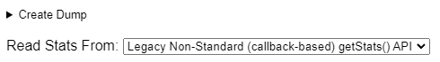</p>
<br>

3. Look for `Stats graphs for bweforvideo (VideoBwe)`.
<p align="center">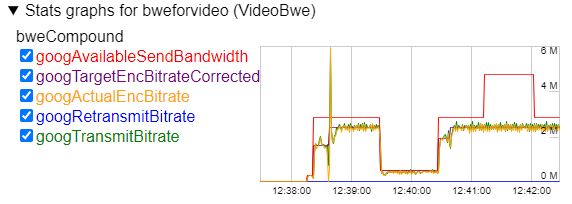</p>
<br>

## References

* [WebRTC for the Curious](https://webrtcforthecurious.com/)
* [WebRTC Glossary](https://webrtcglossary.com/)
* [MDN WebRTC API](https://developer.mozilla.org/en-US/docs/Web/API/WebRTC_API)
* [Any Connect STUN-TURN-ICE](https://anyconnect.com/stun-turn-ice/)
* [Tweaking WebRTC Video Quality](https://bloggeek.me/tweaking-webrtc-video-quality-unpacking-bitrate-resolution-and-frame-rates/)
* [An Introduction to WebRTC Simulcast](https://blog.livekit.io/an-introduction-to-webrtc-simulcast-6c5f1f6402eb)
* [How Discord handles two and half million concurrent voice users using WebRTC](https://discord.com/blog/how-discord-handles-two-and-half-million-concurrent-voice-users-using-webrtc)
* [Samples](https://webrtc.github.io/samples/)
