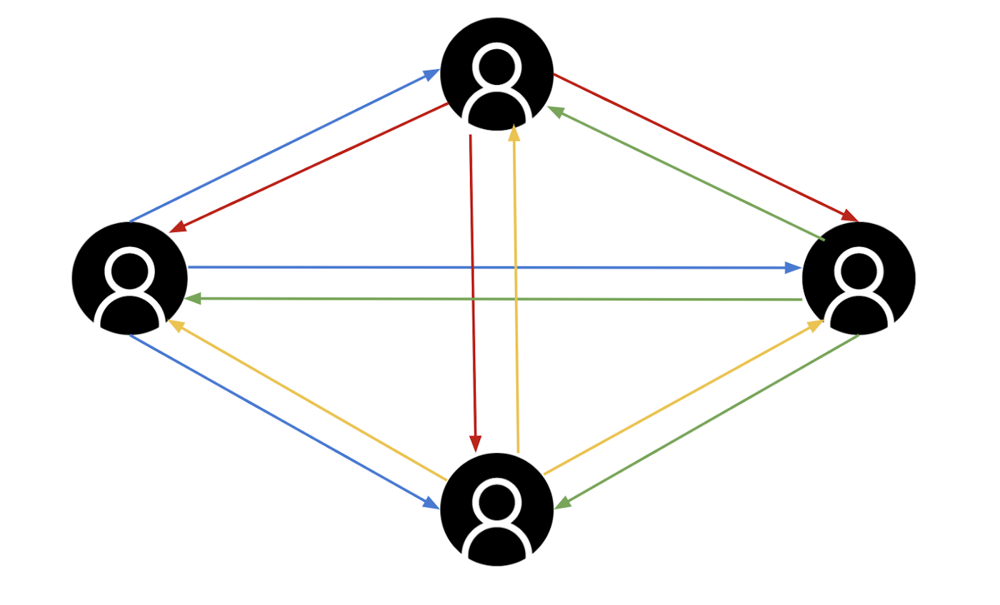
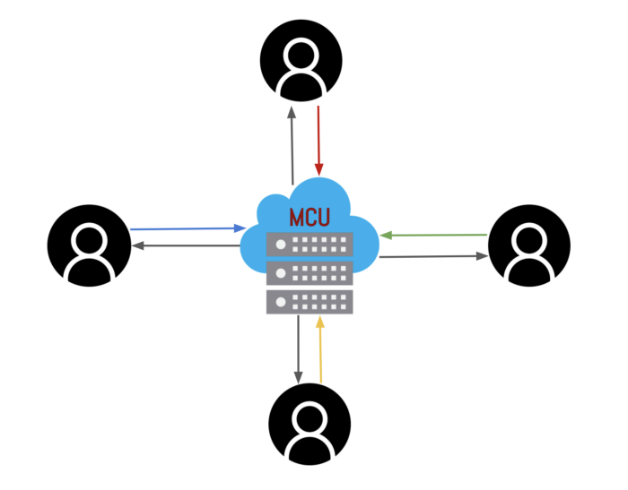
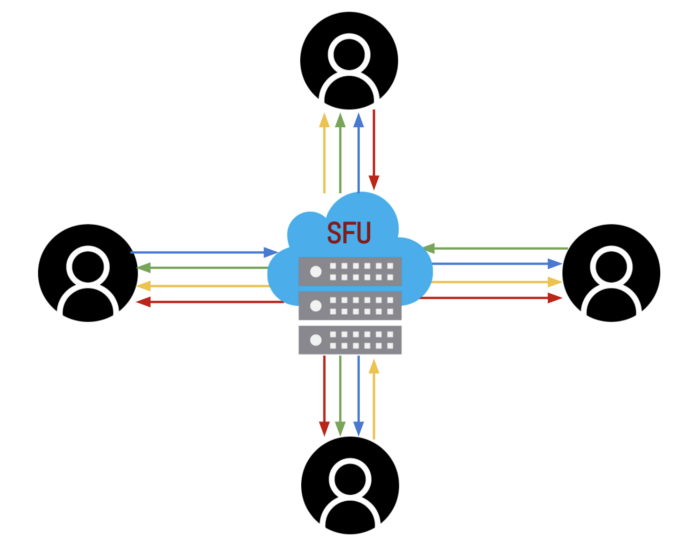

# WebRTC

[WebRTC](https://webrtc.org/) is a free and open-source project providing web browsers and mobile applications with real-time peer-to-peer communications.

## Index

* [ICE](#ice)
* [Topologies](#topologies)
  * [Mesh](#mesh)
  * [MCU](#mcu)
  * [SFU](#sfu)
* [Simulcast](#simulcast)
* [References](#references)

## ICE

[Interactive Connectivity Establishment (ICE)](https://en.wikipedia.org/wiki/Interactive_Connectivity_Establishment) is a protocol for [Network Address Translator (NAT)](https://en.wikipedia.org/wiki/Network_address_translation) traversal used in computer networking to find ways for two computers to talk to each other as directly as possible in [peer-to-peer](https://en.wikipedia.org/wiki/Peer-to-peer) networking.

* Address discovery using [Session Traversal Utilities for NAT (STUN)](https://en.wikipedia.org/wiki/STUN) protocol.
* Relay messages between two peers when direct traffic is not allowed using [Traversal Using Relays around NAT (TURN)](https://en.wikipedia.org/wiki/Traversal_Using_Relays_around_NAT) protocol.

## Topologies

### Mesh

In a mesh topology each peer is directly connected to every other peer. Each peer sends their streams to every single peer and download the streams from every peer.

For a session with N peers the total number of connections is `O(N²)`.

| Peers                    | N      |
|--------------------------|--------|
| Uplinks                  | N(N-1) |
| Downlinks                | N(N-1) |
| Uplinkspeer   | N-1    |
| Downlinkspeer | N-1    |

Pros:
* Lowest latency.
* End-to-end encryption.
* Low server loads.

Cons:
* Poor scaling.
* Connectivity problems with NATs, firewalls, etc.
* High peer loads.

### MCU

In a Multipoint Control Point (MCU) topology each peer connects to the MCU server. With a MCU each peer uploads their stream once, the server `decodes` the stream, mixes the streams of all the peers into one and `encodes` the stream to send it back to each peer.

For a session with N peers the total number of connections is `O(N)`.

| Peers                    | N      |
|--------------------------|--------|
| Uplinks                  | N      |
| Downlinks                | N      |
| Uplinkspeer   | 1      |
| Downlinkspeer | 1      |

Pros:

Cons:

### SFU

## Simulcast

Simulcast allows peers to publish multiple versions of the same stream with different **spatial** or **temporal** encodings, effectively sending more data.

### Spatial

With spatial scalability the lower resolution layers consume less bandwidth than the high resolution ones.

For example:
* High: 1280x720 2.5mbps
* Medium: 640x360 400kbps
* Low: 320x180 125kbps

The peer uses just 17% more bandwidth to publish the three layers.

### Temporal

With temporal scalability it is possible to lower a stream's bitrate by dynamically reducing the stream's frame rate. 

Streams contain mostly **delta** frames which depend on previous **key** frames. If the decoder needs to apply a delta to a key frame that was dropped, it can't render subsequent frames.

When temporal layers are used, frames from the base layer only reference other base layer frames.

For a subscriber with limited bandwidth, it is possible to send only the frames of a specific temporal layer, effectively reducing bandwidth.

## References

* [WebRTC for the Curious](https://webrtcforthecurious.com/)
* [WebRTC Glossary](https://webrtcglossary.com/)
* [WebRTC API MDN](https://developer.mozilla.org/en-US/docs/Web/API/WebRTC_API)
* [Troubleshooter](https://test.webrtc.org/)
* [Samples](https://webrtc.github.io/samples/)
* [Trickle ICE](https://webrtc.github.io/samples/src/content/peerconnection/trickle-ice/)
* [An Introduction to WebRTC Simulcast](https://blog.livekit.io/an-introduction-to-webrtc-simulcast-6c5f1f6402eb)
