# WebRTC

<p align="center"></p>

## Index

* [Introduction](#introduction)
* [Signaling](#signaling)
* [ICE](#ice)
* [SDP](#sdp)
* [Media](#media)
* [Data](#data)
* [Security](#security)
* [Topologies](#topologies)
  * [Mesh](#mesh)
  * [MCU](#mcu)
  * [SFU](#sfu)
* [Simulcast](#simulcast)
* [References](#references)

## Introduction

[Web Real Time Communication (WebRTC)](https://webrtc.org/) is a free and open-source project providing web browsers and mobile applications with real-time [peer-to-peer](https://en.wikipedia.org/wiki/Peer-to-peer) communications. Its specification is still an ongoing work as a cooperative effort between the [World Wide Web Consortium (W3C)](https://en.wikipedia.org/wiki/World_Wide_Web_Consortium) defining the APIs and the [Internet Engineering Task Force(IETF)](https://en.wikipedia.org/wiki/Internet_Engineering_Task_Force) standardizing the protocols.

## Signaling

In WebRTC, although public APIs and protocols are standardized, the initial negotiation and communication establishment is up to the application to implement. This initial handshaking should take care of simple stuff, such as letting one peer know when the other is calling, or more complex stuff like establishing a unique session between two peers and sharing offers, answers and candidates. The part of the application that is in charge of these is called the [signaling server](https://en.wikipedia.org/wiki/Signaling_gateway).

A signaling server should handle:

* **Authentication**. Exchange certificates for secure communication.
* **Media capabilities**. Both peers need to agree on the media formats the session will support.
* **Connection endpoints**. Each peer needs to know how to send data to the other peer.

It is up to the application to ensure that this out-of-bounds communication is performed securely and accessible for both peers.

## ICE

[Interactive Connectivity Establishment (ICE)](https://en.wikipedia.org/wiki/Interactive_Connectivity_Establishment) is a protocol for [Network Address Translator (NAT)](https://en.wikipedia.org/wiki/Network_address_translation) traversal used in computer networking to find ways for two computers to talk to each other as directly as possible in peer-to-peer networking.

In a real world scenario, establishing a connection between 2 peers using ICE has the following steps:

**1. Address discovery**

Each peer is located in a LAN behind a NAT and has a private address, to discover their public addresses each peer uses the [Session Traversal Utilities for NAT (STUN)](https://en.wikipedia.org/wiki/STUN) server.

<p align="center">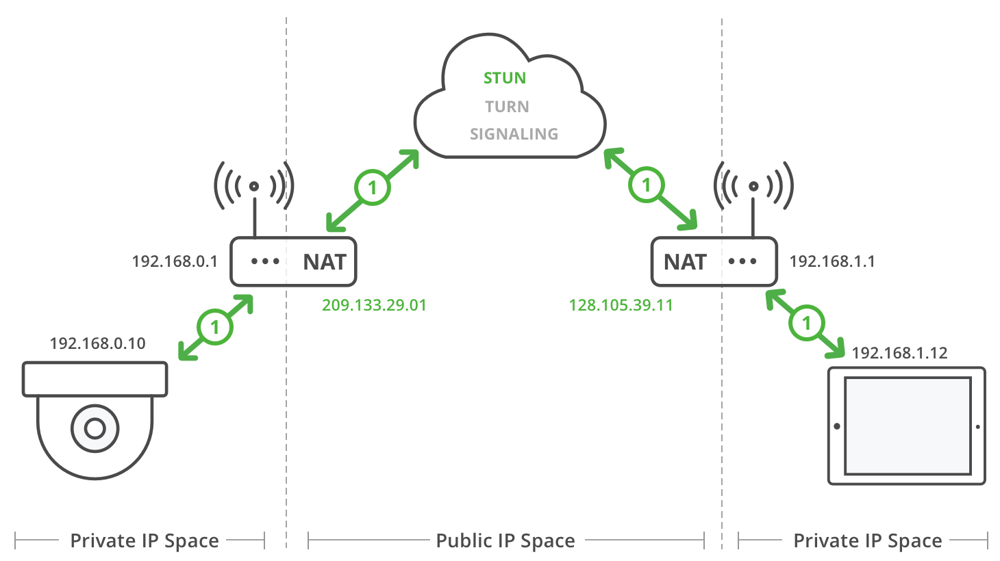</p>

**2. Caller relay allocation**

The caller allocates a connection in the [Traversal Using Relays around NAT (TURN)](https://en.wikipedia.org/wiki/Traversal_Using_Relays_around_NAT) server. The TURN server **relays** the data between two peers when a direct connection is not possible.

<p align="center">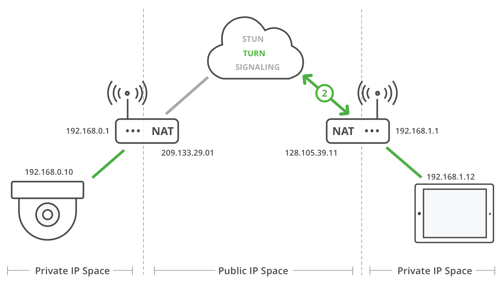</p>

**3. Caller sends offer**

The caller sends a connection **offer** to the callee using a signaling server (both peers are already registered in the signaling server).

<p align="center">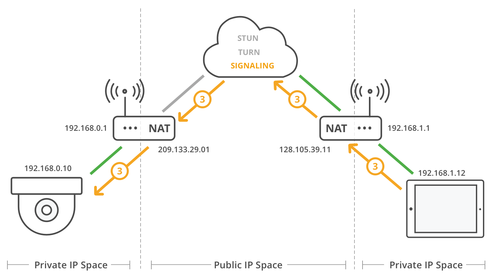</p>

**4. Callee relay allocation**

The callee receives the **offer** and allocates a connection in the TURN server.

<p align="center">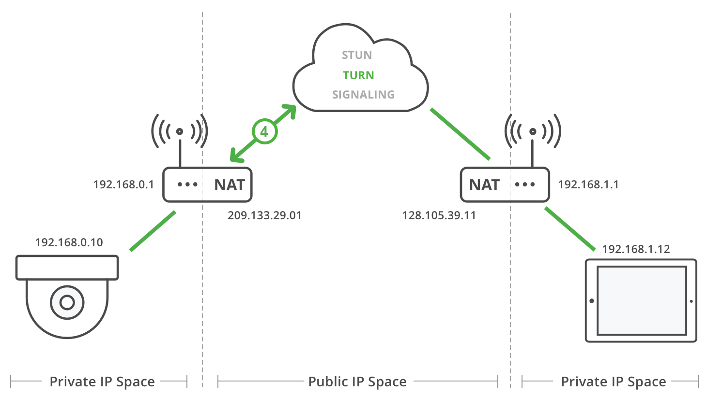</p>

**5. Callee sends answer**

The callee sends a connection **answer** to the caller using the signaling server.

<p align="center">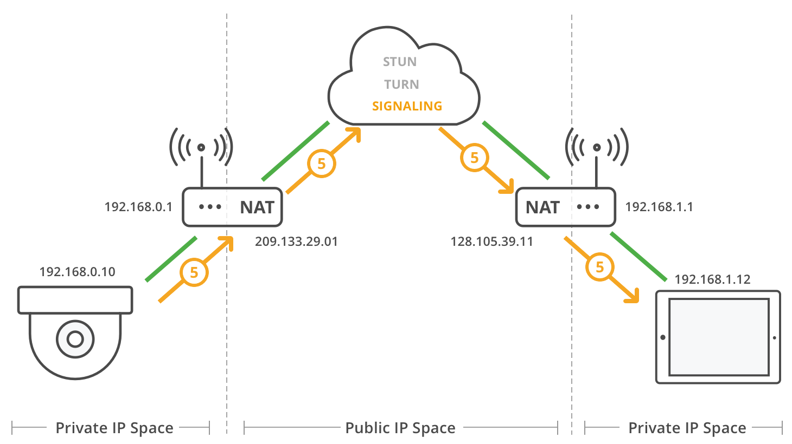</p>

**6. Candidate exchange**

During the offer/answer process, each peer **gathers** candidates to be used for ICE. Each candidate is a potential address/port to receive the data. There are 3 types of candidates:

* **Host**. Generated by the peer by binding to its private IP addresses and ports.
* **Reflex**. Generated by sending query messages to a STUN/TURN server. The query passes through the NAT which creates a binding. The response to the query contains the public IP and port that was generated for the binding.
* **Relay**. Generated by sending query messages to a TURN server. The query passes through the NAT which creates a NAT binding. The response to the query contains the public IP and port that was generated for the binding.

After each candidate is gathered, the candidate is exchanged with the other peer via the offer/answer or standalone using trickle ICE.

<p align="center">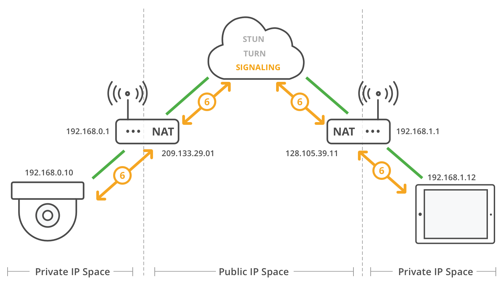</p>

**7a. Check direct connection**

Each peer has an ICE agent making connectivity checks:

* Matches its local candidates with its remote candidates, creating candidate pairs.
* Sends connectivity checks every 20ms, in pair priority, over the binding requests from the local candidate to the remote candidate.
* After receiving the request, the agent generates a response.
* If the response is received, the check has succeeded.

This process may produce additional candidates known as **peer reflexive** candidates. This happens when there is a symmetric NAT in between peers. During the connectivity check process, a STUN request is sent directly to the peer, which can generate a brand new binding. If it does, the STUN response is sent back informing the originating peer that a new binding was formed. This allows peers to have a direct media path between them, even in the presence of a symmetric NAT.

| NAT Type                                                                                                       | STUN support |
|----------------------------------------------------------------------------------------------------------------|--------------|
| [Full Cone NAT](https://en.wikipedia.org/wiki/Network_address_translation#Full-cone_NAT)                       | Yes          |
| [Address Restricted Cone NAT](https://en.wikipedia.org/wiki/Network_address_translation#Restricted-cone_NAT)   | Yes          |
| [Port Restricted Cone NAT](https://en.wikipedia.org/wiki/Network_address_translation#Port-restricted_cone_NAT) | Yes          |
| [Symmetric NAT](https://en.wikipedia.org/wiki/Network_address_translation#Symmetric_NAT)                       | No           |

<p align="center">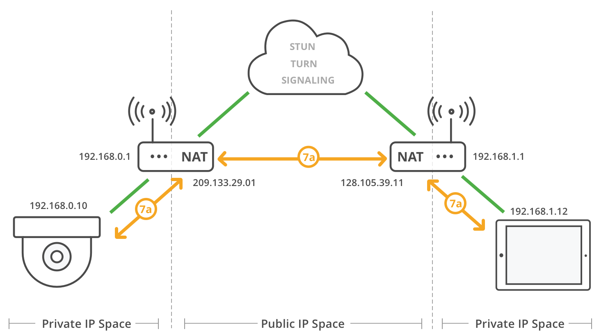</p>

**7b. Use relay connection**

When a direct connection is not possible, the relay candidates are used. TURN servers are guaranteed to work because they are publicly available, unless NATs are specifically configured to block them.

<p align="center">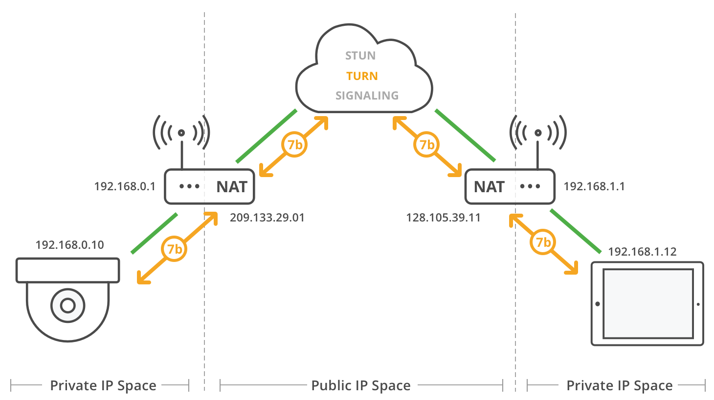</p>

## SDP

[Session Description Protocol (SDP)](https://en.wikipedia.org/wiki/Session_Description_Protocol) is the protocol used to represent the media capabilities of each peer. SDP is already used in other protocols like [Real Time Streaming Protocol (RTSP)](https://en.wikipedia.org/wiki/Real_Time_Streaming_Protocol) or [Session Initiation Protocol (SIP)](https://en.wikipedia.org/wiki/Session_Initiation_Protocol) in streaming applications such as [voice over IP (VoIP)](https://en.wikipedia.org/wiki/Voice_over_IP).

A SDP is generated and sent from each peer during the **offer/answer** process. A SDP has the following structure:

**Session**
```
v=  (protocol version number, currently only 0)
o=  (originator and session identifier : username, id, version number, network address)
s=  (session name : mandatory with at least one UTF-8-encoded character)
i=* (session title or short information)
u=* (URI of description)
e=* (zero or more email address with optional name of contacts)
p=* (zero or more phone number with optional name of contacts)
c=* (connection information—not required if included in all media)
b=* (zero or more bandwidth information lines)
One or more time descriptions ("t=" and "r=" lines; see below)
z=* (time zone adjustments)
k=* (encryption key)
a=* (zero or more session attribute lines)
Zero or more Media descriptions (each one starting by an "m=" line; see below)
```

**Time**
```
t=  (time the session is active)
r=* (zero or more repeat times)
```

**Media**
```
m=  (media name and transport address)
i=* (media title or information field)
c=* (connection information — optional if included at session level)
b=* (zero or more bandwidth information lines)
k=* (encryption key)
a=* (zero or more media attribute lines — overriding the Session attribute lines)
```

An example of SDP:
```
v=0
o=- 0 0 IN IP4 10.47.16.5
s=session007
c=IN IP4 224.2.17.12/127
t=0 0
m=audio 8080 RTP/AVP 111
a=rtpmap:111 OPUS/48000
m=video 9090 RTP/AVP 96
a=rtpmap:96 VP8/90000
```

The session named `session007` has 2 media streams, an audio stream on port `8080` using the codec `OPUS/48000` with payload type `111` and a video stream on port `9090` using the codec `VP8/90000` with payload type `96`.

## Media

Media streams (audio and video) are delivered through [Real-time Transport Protocol (RTP)](https://en.wikipedia.org/wiki/Real-time_Transport_Protocol). This protocol was designed to ensure timely and ordered packet arrival while tolerating data loss due to unreliable channels. RTP is usually used in conjunction with [Real-time Transport Control Protocol (RTCP)](https://en.wikipedia.org/wiki/RTP_Control_Protocol), which provides statistics, quality-of-service and synchronization data to the participants of the session.

## Data

Data streams are delivered through [Stream Control Transmission Protocol (SCTP)](https://en.wikipedia.org/wiki/Stream_Control_Transmission_Protocol). SCTP is a message-oriented **transport** protocol that ensures reliable, in-sequence transport of messages and congestion control. It differs from UDP and TCP in providing multi-homing and redundant paths to increase resilience and reliability.

|                    | UDP              | TCP           | SCTP             |
|--------------------|------------------|---------------|------------------|
| Reliability        | Unreliable       | Reliable      | Configurable     |
| Delivery           | Unordered        | Ordered       | Configurable     |
| Transmission       | Message-oriented | Byte-oriented | Message-oriented |
| Flow control       | No               | Yes           | Yes              |
| Congestion control | No               | Yes           | Yes              |

## Security

[Secure Real-time Transport Protocol (SRTP)](https://en.wikipedia.org/wiki/Secure_Real-time_Transport_Protocol) and [Secure Real-time Transport Control Protocol (SRTCP)](https://en.wikipedia.org/wiki/Secure_Real-time_Transport_Protocol) allow secure data transmission for RTP and RTCP. SRTP enables RTP with authentication and encryption features, and may be disabled if desired, without the need of going back to pure RTP.

Media and data are transmited over [Datagram Transport Layer Security (DTLS)](https://en.wikipedia.org/wiki/Datagram_Transport_Layer_Security), which is based on [Transport Layer Security (TLS)](https://en.wikipedia.org/wiki/Transport_Layer_Security). DTLS preserves the semantics of the underlying SRTP, SRTCP and SCTP but provides means of authentication, symmetric cryptography, privacy and integrity. 

## Topologies

### Mesh

In a mesh topology each peer is directly connected to every other peer. Each peer sends their streams to every single peer and downloads the streams from every peer.

<p align="center">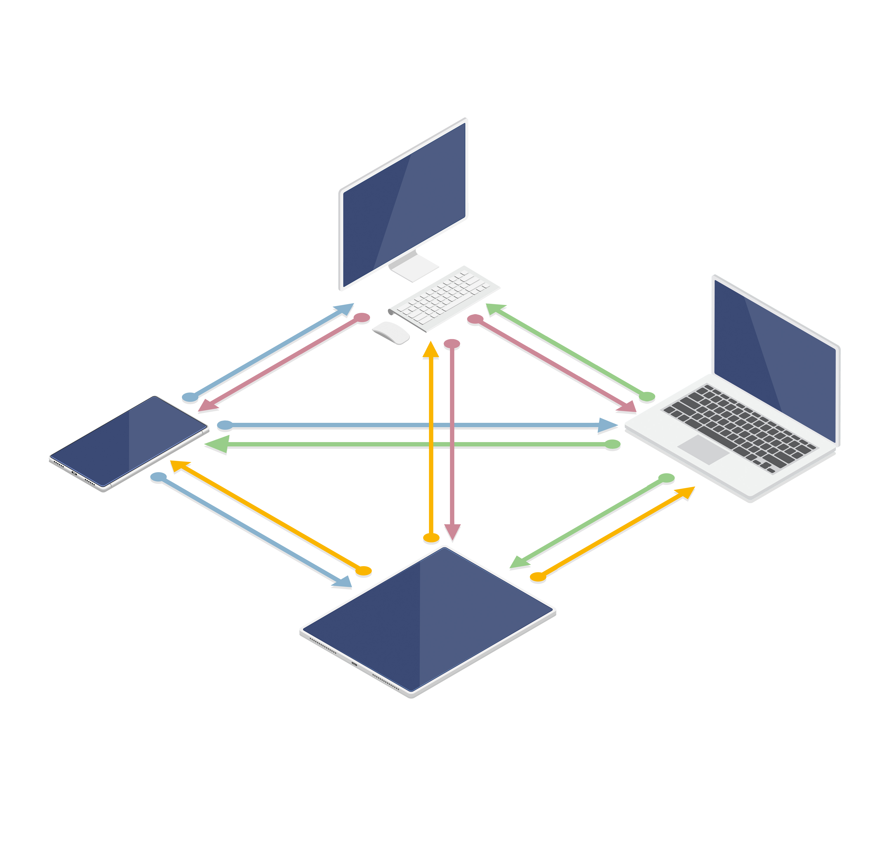</p>

For a session with N peers the total number of connections is `O(N²)`.

| Peers                    | N      |
|--------------------------|--------|
| Uplinks                  | N(N-1) |
| Downlinks                | N(N-1) |
| Uplinks<sub>peer</sub>   | N-1    |
| Downlinks<sub>peer</sub> | N-1    |

Pros:
* Low latency.
* Low server loads.
* End-to-end encryption.

Cons:
* Poor scaling.
* High peer loads.
* Connectivity problems with NATs, firewalls, etc.

### MCU

In a Multipoint Conferencing Unit (MCU) topology each peer connects to the MCU server. With a MCU each peer uploads their stream once, the server `decodes` the stream, mixes the streams of all the peers into one and `encodes` the stream to send it back to each peer.

<p align="center">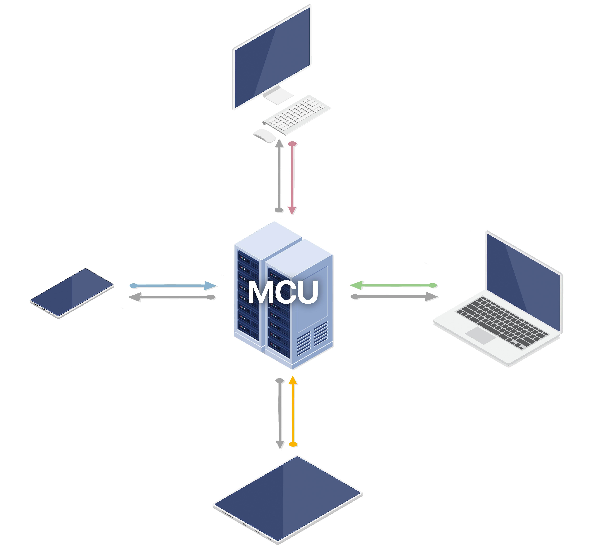</p>

For a session with N peers the total number of connections is `O(N)`.

| Peers                    | N |
|--------------------------|---|
| Uplinks                  | N |
| Downlinks                | N |
| Uplinks<sub>peer</sub>   | 1 |
| Downlinks<sub>peer</sub> | 1 |

Pros:
* Good scaling.
* Low peer loads.
* No connectivity problems.
* Works well in low bandwidth environments.

Cons:
* High latency.
* High server loads.

### SFU

In a Selective Forwarding Unit (SFU) topology each peer connects to the SFU server. With a SFU each peer uploads their stream once and the server `forwards` the stream to every peer.

<p align="center"></p>

For a session with N peers the total number of connections is `O(N²)`.

| Peers                    | N      |
|--------------------------|--------|
| Uplinks                  | N      |
| Downlinks                | N(N-1) |
| Uplinks<sub>peer</sub>   | 1      |
| Downlinks<sub>peer</sub> | N-1    |

Pros:
* Good scaling.
* Medium peer loads.
* Low server loads.
* No connectivity problems.

Cons:
* No end-to-end encryption (although there are experimental approaches of header only decryption).

## Simulcast

Simulcast allows peers to publish multiple versions of the same stream with different **spatial** or **temporal** encodings, effectively sending more data.

### Spatial

With spatial scalability the lower resolution layers consume less bandwidth than the high resolution ones.

For example:
* High: 1280x720 2.5mbps
* Medium: 640x360 400kbps
* Low: 320x180 125kbps

The peer uses just 17% more bandwidth to publish the three layers.

### Temporal

With temporal scalability it is possible to lower a stream's bitrate by dynamically reducing the stream's frame rate. 

Streams contain mostly **delta** frames which depend on previous **key** frames. If the decoder needs to apply a delta to a key frame that was dropped, it can't render subsequent frames.

When temporal layers are used, frames from the base layer only reference other base layer frames.

<p align="center">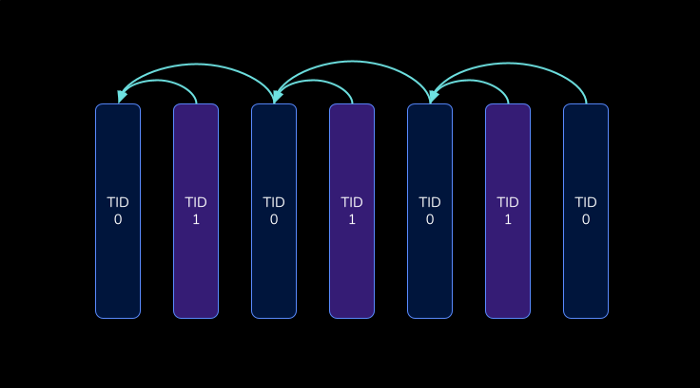</p>

For a subscriber with limited bandwidth, it is possible to send only the frames of a specific temporal layer, effectively reducing bandwidth.

## References

* [WebRTC for the Curious](https://webrtcforthecurious.com/)
* [WebRTC Glossary](https://webrtcglossary.com/)
* [WebRTC API MDN](https://developer.mozilla.org/en-US/docs/Web/API/WebRTC_API)
* [Troubleshooter](https://test.webrtc.org/)
* [Samples](https://webrtc.github.io/samples/)
* [Trickle ICE](https://webrtc.github.io/samples/src/content/peerconnection/trickle-ice/)
* [SDP Anatomy](https://webrtchacks.com/sdp-anatomy/)
* [Any Connect STUN-TURN-ICE](https://anyconnect.com/stun-turn-ice/)
* [HTML5 Rocks WebRTC Data Channels](https://www.html5rocks.com/en/tutorials/webrtc/datachannels/)
* [An Introduction to WebRTC Simulcast](https://blog.livekit.io/an-introduction-to-webrtc-simulcast-6c5f1f6402eb)
